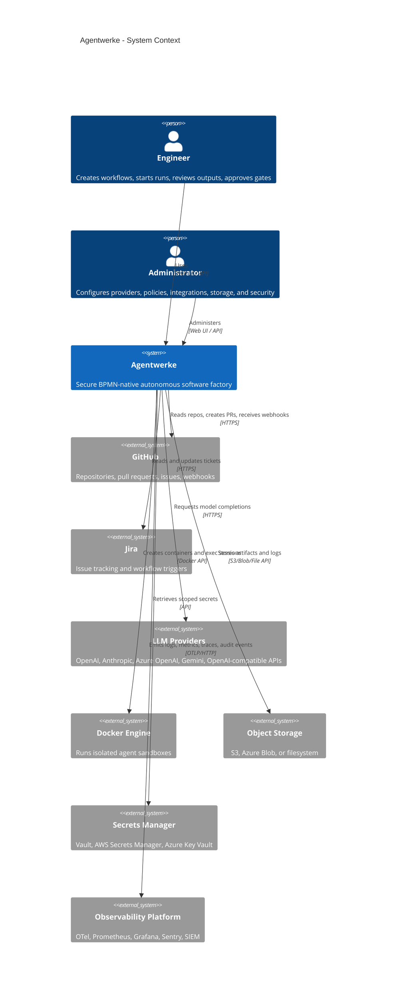
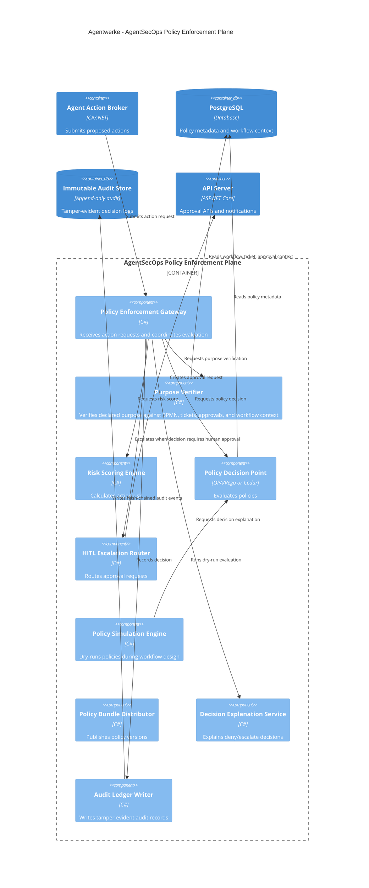
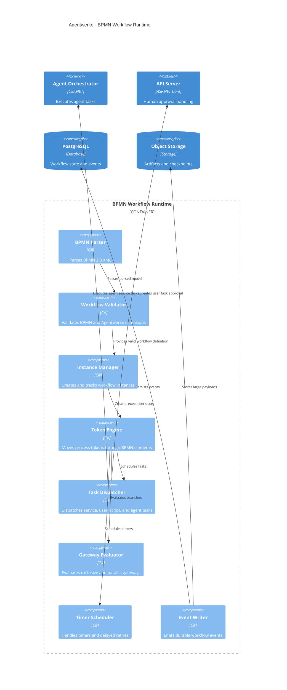
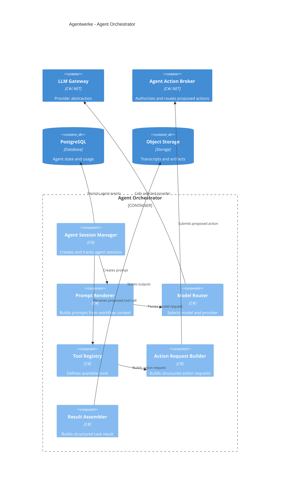
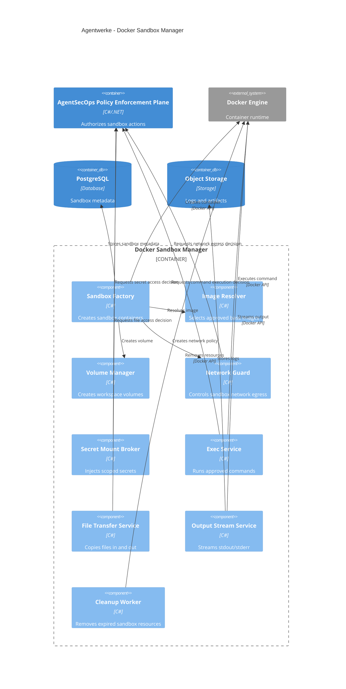

# Agentwerke Architecture Design

## 1. Overview

**Agentwerke** is a secure, BPMN-native, Docker-sandboxed, C#/.NET autonomous software factory for AI-assisted software delivery.

Agentwerke orchestrates specialized LLM-powered agents through **BPMN 2.0 workflows**, executes work inside isolated **Docker sandboxes**, and enforces real-time security and compliance policies through an integrated **AgentSecOps Policy Enforcement Plane**.

Agentwerke is designed for teams that want autonomous software delivery while retaining strong governance, human oversight, auditability, and enterprise-grade security.

---

## 2. Architecture Goals

- Use **C# / ASP.NET Core** as the backend control plane.
- Use **BPMN 2.0** as the primary workflow definition format.
- Use **Docker sandboxes** as the default execution environment.
- Coordinate specialized AI agents for software delivery tasks.
- Enforce real-time security policies on sensitive agent actions.
- Apply **Verified Purpose-Based Access Control** for AI agent behavior.
- Support human-in-the-loop approvals where policy requires it.
- Store durable workflow state, events, approvals, and audit logs.
- Provide full observability over workflow runs and agent actions.
- Integrate with GitHub, Jira, Slack/Teams, LLM providers, cloud APIs, and object storage.

---

## 3. Key Architectural Principle

Agentwerke agents are **not trusted to execute actions directly**.

Every sensitive agent action must flow through a controlled path:

```text
Agent
  -> Agent Action Broker
  -> AgentSecOps Policy Enforcement Plane
  -> Approved Capability
```

Sensitive actions include:

- Git operations
- GitHub or Jira API calls
- Pull request creation or merge
- Shell commands
- File writes
- Secret access
- Network egress
- Cloud API calls
- Deployment actions
- Production environment changes
- External notifications
- MCP tool calls
- LLM tool use

---

## 4. High-Level Architecture

```text
[Engineer / Operator]
        |
        v
[React Web UI + BPMN Modeler]
        |
        | REST / SignalR / SSE / WebSocket
        v
[ASP.NET Core API Server]
        |
        +--> [BPMN Workflow Runtime]
        |
        +--> [Agent Orchestrator]
        |       |
        |       v
        |   [Agent Action Broker]
        |       |
        |       v
        |   [AgentSecOps Policy Enforcement Plane]
        |
        +--> [Docker Sandbox Manager]
        +--> [LLM Gateway]
        +--> [Integration Layer]
        +--> [Human Approval Service]
        +--> [Auth & Secrets Service]
        |
        +--> [PostgreSQL]
        +--> [Object Storage]
        +--> [Immutable Audit Store]
```

---

## 5. Major Components

## 5.1 Web UI

**Technology:** React, TypeScript, BPMN.js, Tailwind CSS

The Web UI is the main interface for workflow design, run monitoring, approvals, audit review, and platform administration.

Responsibilities:

- Design BPMN workflows visually.
- Configure agent tasks and policy tags.
- Start and monitor workflow runs.
- Inspect logs, diffs, artifacts, and agent messages.
- Review policy-triggered approval requests.
- Simulate policy decisions before workflows run.
- Browse immutable audit history.
- Open sandbox terminals.
- Configure integrations, models, secrets, and storage.

Main UI areas:

```text
Web UI
├── BPMN Workflow Designer
├── Run Board
├── Run Detail View
├── Agent Session Viewer
├── Approval Dashboard
├── Policy Simulator
├── Audit Explorer
├── Artifact Browser
├── Sandbox Terminal
└── Settings
```

---

## 5.2 ASP.NET Core API Server

**Technology:** ASP.NET Core, .NET 9, SignalR, OpenAPI

The API Server is the main control plane.

Responsibilities:

- Serve REST APIs.
- Serve SignalR/SSE event streams.
- Authenticate users.
- Authorize user access.
- Manage workflow definitions.
- Start, pause, resume, and cancel workflow runs.
- Coordinate the BPMN runtime.
- Expose approval workflows.
- Manage policy bundles.
- Serve audit and observability data.
- Handle external webhooks.

Suggested projects:

```text
Agentwerke.Api
Agentwerke.Application
Agentwerke.Domain
Agentwerke.Infrastructure
Agentwerke.Workflows
Agentwerke.Agents
Agentwerke.AgentSecOps
Agentwerke.Sandboxes
Agentwerke.Integrations
Agentwerke.Storage
Agentwerke.Observability
```

---

## 5.3 BPMN Workflow Runtime

**Technology:** C#, BPMN 2.0 XML, custom Agentwerke BPMN extensions

Agentwerke uses BPMN as the primary workflow model.

The runtime executes BPMN workflow instances and coordinates task dispatch.

Responsibilities:

- Parse BPMN XML.
- Validate supported BPMN elements.
- Interpret Agentwerke BPMN extension elements.
- Create workflow instances.
- Move tokens through BPMN process graphs.
- Execute service tasks.
- Suspend on user tasks.
- Resume from approvals.
- Handle gateways, timers, boundary events, and retries.
- Emit durable workflow events.

Supported BPMN concepts:

| BPMN Element | Agentwerke Meaning |
|---|---|
| Start Event | Begin workflow run |
| End Event | Complete workflow run |
| Service Task | Agent task, integration task, command task |
| User Task | Human approval or review |
| Script Task | Controlled sandbox script |
| Exclusive Gateway | Conditional branch |
| Parallel Gateway | Parallel execution |
| Boundary Event | Timeout, failure, escalation |
| Timer Event | Delay or scheduled retry |
| Subprocess | Reusable workflow block |

Example Agentwerke BPMN extension:

```xml
<bpmn:serviceTask id="DeployProduction" name="Deploy to Production">
  <bpmn:extensionElements>
    <agentwerke:agentTask
      agent="DeploymentAgent"
      action="cloud.deploy_artifact"
      environment="production"
      purposeType="production_deployment"
      policyTag="production_deployment_gateway"
      requiresEvidence="ci_passed,sast_passed,human_approval" />
  </bpmn:extensionElements>
</bpmn:serviceTask>
```

---

## 5.4 Agent Orchestrator

**Technology:** C#, async services, prompt rendering, tool registry

The Agent Orchestrator manages AI-powered work.

Responsibilities:

- Create agent sessions.
- Build prompts from workflow context.
- Route model requests.
- Manage agent memory and context.
- Receive proposed tool calls.
- Convert proposed actions into structured action requests.
- Send all sensitive actions through the Agent Action Broker.
- Persist agent events and outputs.

Main concepts:

```text
AgentSession
AgentTask
AgentMessage
ToolCall
ToolResult
PromptTemplate
ModelRoute
ExecutionContext
AgentActionRequest
```

Important rule:

> Agents do not execute tools directly. Agents propose actions. Agentwerke evaluates and authorizes those actions before execution.

---

## 5.5 Agent Action Broker

The **Agent Action Broker** is the mandatory gateway between agents and platform capabilities.

Responsibilities:

- Normalize agent-proposed actions.
- Attach workflow context.
- Attach BPMN element metadata.
- Attach agent identity.
- Attach verified purpose metadata.
- Attach available evidence.
- Request AgentSecOps policy evaluation.
- Enforce returned constraints.
- Route approved actions to the correct capability provider.

Example action request:

```json
{
  "requestId": "act_01HZ8P3K",
  "agentId": "CodeSmithBot",
  "workflowInstanceId": "run_123",
  "bpmnElementId": "ImplementFeature",
  "actionType": "github.create_pull_request",
  "target": {
    "repository": "org/payment-service",
    "baseBranch": "main",
    "headBranch": "agentwerke/JIRA-123-auth-fix"
  },
  "purpose": {
    "type": "feature_implementation",
    "jiraKey": "JIRA-123",
    "summary": "Implement OAuth2 authentication module"
  },
  "evidence": {
    "testsPassed": true,
    "sastPassed": true,
    "diffRisk": "medium"
  }
}
```

---

## 5.6 AgentSecOps Policy Enforcement Plane

The **AgentSecOps Policy Enforcement Plane** is a first-class Agentwerke subsystem that evaluates every sensitive AI agent action before execution.

It provides real-time, purpose-aware, context-aware policy enforcement.

Responsibilities:

- Evaluate proposed agent actions.
- Verify agent identity.
- Verify declared purpose against workflow context.
- Calculate action risk.
- Enforce security and compliance policies.
- Block prohibited actions.
- Escalate risky actions to humans.
- Require additional evidence when needed.
- Allow actions with constraints.
- Write immutable audit records.
- Support policy simulation and dry-runs.

Component structure:

```text
AgentSecOps Policy Enforcement Plane
├── Policy Enforcement Gateway
├── Policy Decision Point
├── Purpose Verifier
├── Risk Scoring Engine
├── HITL Escalation Router
├── Policy Simulation Engine
├── Policy Bundle Distributor
├── Audit Ledger Writer
└── Decision Explanation Service
```

Policy decisions:

```text
ALLOW
DENY
ESCALATE_TO_HUMAN
ALLOW_WITH_CONSTRAINTS
REQUIRE_ADDITIONAL_EVIDENCE
REWRITE_TO_SAFER_ACTION
QUARANTINE_AGENT_SESSION
```

---

## 5.7 Verified Purpose-Based Access Control

Agentwerke uses **Verified Purpose-Based Access Control**, or Verified PBAC.

Traditional access control evaluates:

```text
who + what + where
```

Agentwerke evaluates:

```text
who + what + where + when + why + evidence + risk + workflow context
```

The agent-declared purpose is useful but not trusted by itself.

Agentwerke verifies purpose using:

```text
Verified Purpose =
    agent-declared purpose
  + BPMN task metadata
  + workflow trigger context
  + user-submitted goal
  + GitHub/Jira issue metadata
  + CI/CD evidence
  + human approvals
  + repository policy
  + environment classification
  + previous workflow events
```

Purpose trust levels:

| Purpose Source | Trust Level |
|---|---|
| Agent-generated purpose | Low |
| BPMN task metadata | Medium |
| User-submitted workflow input | Medium |
| GitHub/Jira issue context | Medium |
| Human approval | High |
| Admin-defined policy metadata | High |
| System-derived execution context | High |

Bad policy example:

```text
ALLOW if purpose contains "hotfix"
```

Preferred policy model:

```json
{
  "type": "critical_hotfix",
  "incidentId": "INC-789",
  "linkedTicketVerified": true,
  "targetEnvironment": "production",
  "humanApprovalRequired": true
}
```

---

## 5.8 Risk-Based Enforcement

Not every action should require human approval. Agentwerke uses risk-based enforcement to reduce alert fatigue.

| Risk Level | Example | Decision Style |
|---|---|---|
| Low | Add draft PR comment | Auto-allow after policy check |
| Medium | Create branch or open PR | Allow with evidence |
| High | Merge PR or access secret | Require stronger evidence or approval |
| Critical | Production deployment or IAM change | Mandatory human approval |
| Prohibited | Force-push main, exfiltrate secrets | Always deny |

Example:

```text
Action: deploy to production
Risk: critical
Decision: ESCALATE_TO_HUMAN
Required evidence:
- CI passed
- SAST passed
- artifact signed
- release manager approval
- SRE lead approval
```

---

## 5.9 Policy Engine

**Recommended technologies:** OPA/Rego, Cedar, or pluggable policy engine abstraction

Agentwerke should provide a policy abstraction:

```csharp
public interface IPolicyDecisionPoint
{
    Task<PolicyDecision> EvaluateAsync(
        AgentActionRequest request,
        CancellationToken cancellationToken);
}
```

Suggested implementations:

```text
Agentwerke.Policy.Opa
Agentwerke.Policy.Cedar
Agentwerke.Policy.InMemory
```

Recommended initial choice:

- Start with **OPA/Rego** because of maturity and cloud-native ecosystem support.
- Add Cedar later for customers that prefer authorization-focused policy semantics.

---

## 5.10 Policy Lifecycle Management

Policies must be treated like code.

Policy lifecycle:

```text
Draft
  -> Validate
  -> Unit Test
  -> Simulate
  -> Review
  -> Approve
  -> Publish
  -> Monitor
  -> Deprecate
```

Policy capabilities:

- Versioned policies.
- Policy unit tests.
- Policy dry-run mode.
- Policy simulation.
- Policy impact analysis.
- Policy coverage reports.
- Policy ownership.
- Staged rollout.
- Decision explanations.
- Emergency rollback.

Example policy test:

```yaml
name: deny-production-deploy-without-approval
input:
  agent: DeploymentAgent
  action: cloud.deploy_artifact
  environment: production
  approvals: []
expected:
  decision: ESCALATE_TO_HUMAN
```

---

## 5.11 Policy Simulation Engine

The Policy Simulation Engine helps workflow designers understand how policies will affect a workflow before it runs.

Example UI output:

```text
Task: Deploy to Production
Policy Tag: production_deployment_gateway
Expected Decision: ESCALATE_TO_HUMAN
Required Approvers:
- Release Manager
- SRE Lead

Required Evidence:
- CI passed
- SAST passed
- artifact signed
```

Benefits:

- Reduces surprise policy denials.
- Reduces human approval fatigue.
- Helps teams design compliant workflows.
- Makes security rules visible during workflow authoring.

---

## 5.12 Human Approval Service

Human approvals are modeled as BPMN **User Tasks** and can also be dynamically triggered by AgentSecOps.

Approval sources:

```text
Explicit BPMN User Task
Dynamic AgentSecOps Escalation
Manual Operator Intervention
Emergency Break-Glass Flow
```

Supported decisions:

```text
Approve
Deny
Request Clarification
Approve Once
Approve For This Run
Approve With Constraints
Escalate
Quarantine Run
```

Example approval with constraints:

```json
{
  "decision": "approve_with_constraints",
  "constraints": {
    "environment": "staging",
    "maxDurationMinutes": 30,
    "noSecretAccess": true,
    "noProductionDatabaseWrites": true
  }
}
```

HITL controls:

- Approval batching
- Risk-based routing
- Approval delegation
- Timeouts
- Escalation paths
- Denial templates
- Decision explanations
- Approval audit trail
- Break-glass flow

---

## 5.13 Docker Sandbox Manager

**Technology:** Docker Engine API, Docker.DotNet

The Docker Sandbox Manager creates isolated execution environments for agent work.

Responsibilities:

- Create per-run containers.
- Create per-run networks.
- Create per-run volumes.
- Clone repositories.
- Execute commands.
- Stream stdout/stderr.
- Copy files in and out.
- Expose preview ports.
- Apply CPU and memory limits.
- Destroy or preserve sandboxes.

---

## 5.14 Docker Sandbox Guard

The Docker Sandbox Guard extends the sandbox manager with policy enforcement.

It ensures agents cannot bypass Agentwerke policy controls from inside a container.

Controls:

```text
Docker Sandbox Guard
├── Command Policy
├── File Access Policy
├── Secret Mount Broker
├── Network Egress Guard
├── DNS Allowlist
├── Package Registry Allowlist
├── Container Image Policy
├── Resource Limits
├── Runtime Security Profile
└── Cleanup Policy
```

Examples:

| Sandbox Action | Policy Result |
|---|---|
| `git push origin main` | Deny |
| `cat .env` | Deny unless secret-read purpose is verified |
| `curl unknown-domain.com` | Deny or escalate |
| `npm install` | Allow only approved registries |
| `docker run --privileged` | Deny |
| `aws iam attach-role-policy` | Critical HITL |

Important security rule:

> External integration policy is not enough. Sandbox commands, network access, and secret access must also be governed.

---

## 5.15 LLM Gateway

The LLM Gateway normalizes access to model providers.

Supported providers:

- OpenAI
- Anthropic
- Azure OpenAI
- Google Gemini
- OpenAI-compatible APIs
- Local models through Ollama or LM Studio

Responsibilities:

- Normalize request and response formats.
- Support streaming.
- Apply retries and backoff.
- Track token usage and cost.
- Redact sensitive data.
- Apply model routing rules.

Suggested interface:

```csharp
public interface IModelProvider
{
    Task<ModelResponse> CompleteAsync(
        ModelRequest request,
        CancellationToken cancellationToken);

    IAsyncEnumerable<ModelStreamEvent> StreamAsync(
        ModelRequest request,
        CancellationToken cancellationToken);
}
```

---

## 5.16 Integration Layer

The Integration Layer connects Agentwerke to external systems.

Connectors:

```text
Integration Layer
├── GitHub Connector
├── GitLab Connector
├── Azure DevOps Connector
├── Jira Connector
├── Slack Connector
├── Microsoft Teams Connector
├── AWS Connector
├── Azure Connector
├── GCP Connector
└── Monitoring Connectors
```

Important rule:

> Outbound agent-initiated integration calls must be authorized by AgentSecOps before execution.

Examples:

- Create pull request
- Merge pull request
- Add Jira comment
- Change Jira status
- Send Slack notification
- Trigger deployment
- Modify cloud infrastructure
- Create incident ticket

---

## 5.17 Persistence Layer

### PostgreSQL

**Technology:** PostgreSQL, Entity Framework Core

Stores structured data:

- Users
- Organizations
- Projects
- Repositories
- Workflow definitions
- Workflow versions
- Workflow instances
- BPMN metadata
- Run state
- Run events
- Agent sessions
- Human approvals
- Sandbox metadata
- Policy bundles
- Policy decisions
- Model usage
- Audit metadata

### Object Storage

**Technology:** Local filesystem, S3-compatible storage, Azure Blob Storage

Stores large artifacts:

- Logs
- Agent transcripts
- Patches
- Diffs
- Generated files
- Checkpoints
- Uploaded files
- Sandbox archives

### Immutable Audit Store

Stores tamper-evident audit events.

Recommended design:

```text
audit_event_n.hash =
  SHA256(audit_event_n.payload + audit_event_n.previousHash)
```

Optional export targets:

- S3 Object Lock
- Azure immutable blobs
- SIEM
- OpenTelemetry collector
- WORM storage

---

## 5.18 Observability

Recommended stack:

- Serilog
- OpenTelemetry
- Prometheus
- Grafana
- Sentry
- SIEM export

Tracked metrics:

- Workflow run count
- Workflow success/failure rate
- Agent task duration
- Sandbox startup time
- Command execution time
- LLM request latency
- Token usage
- Model cost
- Policy decision latency
- Policy deny rate
- HITL approval latency
- Queue depth

---

# 6. C4 Model

---

## C4 Level 1: System Context



---

## C4 Level 2: Container Diagram

```mermaid
C4Container
    title Agentwerke - Container Diagram

    Person(engineer, "Engineer", "Uses Agentwerke")

    System_Boundary(agentwerke, "Agentwerke") {
        Container(web, "Web UI", "React, TypeScript, BPMN.js", "Workflow designer, run board, approvals, audit explorer")
        Container(api, "API Server", "ASP.NET Core", "REST API, auth, orchestration facade, SignalR/SSE")
        Container(workflow, "BPMN Workflow Runtime", "C#/.NET", "Executes BPMN workflow instances")
        Container(agent, "Agent Orchestrator", "C#/.NET", "Runs AI agent sessions")
        Container(broker, "Agent Action Broker", "C#/.NET", "Normalizes proposed agent actions")
        Container(policy, "AgentSecOps Policy Enforcement Plane", "C#/.NET + OPA/Rego or Cedar", "Evaluates policy, verified purpose, risk, HITL escalation")
        Container(sandbox, "Docker Sandbox Manager", "C#, Docker.DotNet", "Creates containers, executes commands, streams output")
        Container(llmgateway, "LLM Gateway", "C#/.NET", "Normalizes model provider access")
        Container(integrations, "Integration Layer", "C#/.NET", "GitHub, Jira, Slack, cloud, monitoring connectors")
        ContainerDb(db, "PostgreSQL", "PostgreSQL", "State, workflow instances, events, approvals, policies")
        ContainerDb(obj, "Object Storage", "S3 / Blob / Filesystem", "Logs, artifacts, patches, checkpoints")
        ContainerDb(audit, "Immutable Audit Store", "Append-only store", "Tamper-evident policy and action audit trail")
    }

    System_Ext(github, "GitHub", "Repos, PRs, issues")
    System_Ext(jira, "Jira", "Issues and project workflow")
    System_Ext(llm, "LLM Providers", "OpenAI, Anthropic, Gemini, Azure OpenAI")
    System_Ext(docker, "Docker Engine", "Container runtime")
    System_Ext(secrets, "Secrets Manager", "External secret store")

    Rel(engineer, web, "Uses", "HTTPS")
    Rel(web, api, "Calls APIs and receives live updates", "REST / SignalR / SSE")

    Rel(api, workflow, "Starts and resumes workflows")
    Rel(workflow, agent, "Dispatches agent tasks")
    Rel(agent, broker, "Submits proposed actions")
    Rel(broker, policy, "Requests policy decision")

    Rel(policy, db, "Reads policies and writes decisions")
    Rel(policy, audit, "Writes immutable audit events")
    Rel(policy, api, "Escalates approval requests")

    Rel(broker, sandbox, "Executes approved sandbox actions")
    Rel(broker, integrations, "Executes approved external actions")
    Rel(agent, llmgateway, "Requests model completions")

    Rel(sandbox, docker, "Creates containers and exec sessions", "Docker API")
    Rel(integrations, github, "GitHub API calls", "HTTPS")
    Rel(integrations, jira, "Jira API calls", "HTTPS")
    Rel(llmgateway, llm, "Model API calls", "HTTPS")
    Rel(policy, secrets, "Authorizes scoped secret access", "API")

    Rel(api, db, "Reads/writes state", "EF Core")
    Rel(api, obj, "Reads/writes artifacts", "Storage SDK")
```



---

## C4 Level 3: AgentSecOps Policy Enforcement Plane



---

## C4 Level 3: BPMN Workflow Runtime



---

## C4 Level 3: Agent Orchestrator



---

## C4 Level 3: Docker Sandbox Manager



---

# 7. Core Runtime Flow

```text
1. User designs BPMN workflow in the Web UI.
2. BPMN workflow includes Agentwerke extension metadata for agent tasks and policy tags.
3. User starts a workflow run.
4. API Server creates workflow instance.
5. BPMN Runtime moves token to an agent service task.
6. Agent Orchestrator starts an agent session.
7. Agent proposes an action.
8. Agent Action Broker builds a structured action request.
9. AgentSecOps evaluates:
   - agent identity
   - action type
   - target resource
   - declared purpose
   - verified purpose
   - BPMN context
   - environment
   - evidence
   - risk score
   - active policies
10. AgentSecOps returns:
   - allow
   - deny
   - escalate to human
   - allow with constraints
   - require more evidence
   - quarantine
11. If approved, action executes through:
   - Docker Sandbox Manager
   - Integration Layer
   - LLM Gateway
   - Secret Broker
12. All actions and decisions are written to the audit ledger.
13. Workflow continues, branches, pauses, fails, or completes.
```

---

# 8. Security Model

## 8.1 Agent Identity

Each agent has a unique identity.

Example:

```text
CodeSmithBot
PRGuardianAI
IncidentResponseBot
DeploymentAgent
DocWriterAI
SecurityReviewAgent
```

Agent identity is used in:

- Policy decisions
- Audit logs
- Secret access
- Tool permissions
- Risk scoring
- HITL routing

---

## 8.2 Least Privilege for Agents

Agents receive only the capabilities needed for their BPMN task.

Examples:

| Agent | Allowed Capabilities |
|---|---|
| Documentation Agent | Read code, write docs draft, open documentation PR |
| PR Review Agent | Read PR, comment on PR, run checks |
| Code Generation Agent | Create branch, edit files, run tests, open PR |
| Deployment Agent | Deploy only approved artifacts |
| Incident Agent | Read monitoring alerts, propose rollback, request approval |

---

## 8.3 Sandbox Security

Docker socket access is powerful and must be treated as high risk.

Mitigations:

- Dedicated Docker host recommended.
- No privileged containers.
- Per-run Docker networks.
- Per-run volumes.
- Resource limits.
- Egress controls.
- Approved image policy.
- Scoped secret injection.
- Automatic cleanup.
- Immutable audit records.
- Optional rootless Docker.
- Future Kubernetes job provider.

---

## 8.4 Prompt Injection Defense

Agentwerke uses layered defenses:

- Prompt sanitization.
- Tool-use authorization.
- Output validation.
- Structured action schemas.
- Verified purpose checks.
- Secret redaction.
- Sandbox isolation.
- Policy enforcement before side effects.
- HITL for risky actions.

Important principle:

> Even if an LLM is prompt-injected, the agent still cannot perform sensitive actions unless AgentSecOps authorizes them.

---

# 9. Recommended Technology Choices

| Layer | Technology |
|---|---|
| Backend API | ASP.NET Core / .NET 9 |
| Web UI | React + TypeScript |
| Workflow Format | BPMN 2.0 XML |
| BPMN Editor | BPMN.js |
| Workflow Runtime | Camunda 8 in production via Agentwerke adapter; in-process C# runtime for tests/simulation only |
| Realtime Updates | SignalR + SSE |
| Sandbox Runtime | Docker Engine |
| Docker Client | Docker.DotNet |
| Policy Engine | OPA/Rego initially, Cedar optional |
| Database | PostgreSQL |
| ORM | Entity Framework Core |
| Object Storage | S3, Azure Blob, filesystem |
| LLM Providers | OpenAI, Anthropic, Azure OpenAI, Gemini |
| GitHub Integration | Octokit |
| Logging | Serilog |
| Metrics/Tracing | OpenTelemetry |
| Error Reporting | Sentry |

---

# 10. Deployment Architecture

## 10.1 Self-Hosted Docker Compose

```yaml
services:
  agentwerke-api:
    image: ghcr.io/example/agentwerke:latest
    restart: unless-stopped
    ports:
      - "32276:8080"
    volumes:
      - /var/run/docker.sock:/var/run/docker.sock
      - agentwerke-storage:/storage
    environment:
      ASPNETCORE_URLS: http://+:8080
      ConnectionStrings__Postgres: Host=postgres;Database=agentwerke;Username=agentwerke;Password=agentwerke
      Storage__Provider: local
      Storage__Root: /storage
      Policy__Engine: opa
    depends_on:
      - postgres
      - opa

  postgres:
    image: postgres:17
    restart: unless-stopped
    environment:
      POSTGRES_DB: agentwerke
      POSTGRES_USER: agentwerke
      POSTGRES_PASSWORD: agentwerke
    volumes:
      - postgres-data:/var/lib/postgresql/data

  opa:
    image: openpolicyagent/opa:latest
    command:
      - run
      - --server
      - --addr=0.0.0.0:8181
      - /policies
    volumes:
      - ./policies:/policies:ro

  caddy:
    image: caddy:2-alpine
    restart: unless-stopped
    ports:
      - "80:80"
      - "443:443"
    depends_on:
      - agentwerke-api
    volumes:
      - ./Caddyfile:/etc/caddy/Caddyfile
      - caddy-data:/data
      - caddy-config:/config

volumes:
  agentwerke-storage:
  postgres-data:
  caddy-data:
  caddy-config:
```

---

# 11. Roadmap

## Phase 1: Platform Foundation

- ASP.NET Core API
- React Web UI shell
- PostgreSQL schema
- BPMN upload and validation
- Basic workflow instance model
- Basic run event stream

## Phase 2: Camunda 8 Runtime Integration

- Camunda 8 local/runtime profile
- Camunda-compatible BPMN projection
- Workflow publish deployment to Camunda
- Process instance start from Agentwerke APIs
- Agent service-task job workers
- User-task approval bridge
- Durable workflow state through Camunda

## Phase 3: Docker Sandbox Execution

- Docker Sandbox Manager
- Command execution
- File transfer
- Log streaming
- Sandbox cleanup
- Resource limits

## Phase 4: Agent Runtime

- Agent Orchestrator
- LLM Gateway
- Tool Registry
- Prompt Renderer
- Artifact capture
- Git operations

## Phase 5: AgentSecOps

- Agent Action Broker
- Policy Enforcement Gateway
- OPA/Rego policy support
- Verified purpose model
- Risk scoring
- HITL escalation
- Immutable audit ledger
- Policy simulation

## Phase 6: Integrations

- GitHub App
- Jira connector
- Slack/Teams approvals
- S3-compatible object storage
- Secrets manager integration
- SIEM export

## Phase 7: Enterprise Hardening

- SSO
- RBAC
- Policy lifecycle management
- Audit exports
- Multi-worker scale-out
- Kubernetes sandbox provider
- Advanced network egress control

---

# 12. Summary

Agentwerke is a secure, autonomous software factory built around:

```text
BPMN workflows
+ C#/.NET control plane
+ Docker sandboxes
+ LLM-powered agents
+ AgentSecOps policy enforcement
+ Verified Purpose-Based Access Control
+ Human-in-the-loop governance
+ Immutable auditability
```

The key differentiator is **Agentwerke AgentSecOps**:

> Every sensitive AI agent action is evaluated against verified purpose, workflow context, evidence, risk, and policy before it is allowed to affect code, infrastructure, secrets, or external systems.

This makes Agentwerke suitable for enterprise-grade autonomous software development where speed, safety, compliance, and auditability are all required.
