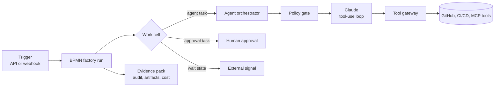

<div align="center">

# Agentwerke

### Governed Lights-Out Software Factory

**Agentwerke by Isartor AI runs autonomous coding agents through enterprise integrations, BPMN workflows, policy gates, approvals, sandboxes, and audit-ready evidence packs.**

[](global.json)
[](docs/decisions/ADR-002-use-bpmn-centric-autofac-runtime-by-default.md)
[](src/Autofac.Agents/Models/AnthropicLanguageModelClient.cs)
[](LICENSE)

[Premise](#premise) | [Factory line](#factory-line) | [Quick start](#quick-start) | [Architecture](#architecture) | [API](#api-reference) | [Docs](#documentation)

</div>

---

## Premise

Agentwerke is the new product name for the platform formerly known as Autofac.
The origin is still Philip K. Dick's 1955 story [Autofac](https://en.wikipedia.org/wiki/Autofac): a postwar world where automatic factories keep manufacturing after meaningful human control has slipped away.

That warning is the product thesis.

AI agents can now plan, code, test, review, and open pull requests. Left alone, that power becomes another opaque production system: fast, tireless, difficult to interrogate, and too easy to trust because it looks useful.

Agentwerke is the countermeasure. It is not another coding agent. It is the enterprise control plane around the agents: the factory floor where every job has a process model, every tool call crosses a policy gate, every sandbox has a boundary, and every run leaves evidence behind.

- **Autonomy without blind trust.** Agents can act, but they do not get direct access to sensitive tools, credentials, networks, repositories, or deployment paths.
- **Workflow over vibes.** Software delivery is modeled as versioned BPMN, not hidden in a prompt transcript.
- **Sandboxes by default.** Agent work happens inside controlled Docker or OpenSandbox execution environments.
- **Humans at the right choke points.** Approval gates, wait states, and policy outcomes are part of the process, not exceptions bolted on later.
- **Evidence as exhaust.** Prompts, redactions, tool calls, policy decisions, costs, artifacts, and outcomes are captured into evidence packs.
- **Self-hosted by design.** Run the factory on your infrastructure with your model keys and your data boundary.

> The point is not to make agents harmless. The point is to make powerful automation inspectable, interruptible, and accountable.

## Factory line



A run moves through the nodes of a BPMN model. When it reaches an agent task, the orchestrator assembles the agent profile, skill, run context, and available tools, then evaluates policy before the model receives work. Claude can request tool calls, but every call is brokered through the Tool Gateway, checked against policy, executed in the right boundary, and recorded. Approval tasks pause for a human. Wait states resume from external signals such as green CI or a merged PR. The final output is not just code; it is code plus the evidence of how it was produced.

## What is built

| Capability | Status |
| --- | --- |
| BPMN-native workflow runtime with durable checkpoints | Built |
| Real agents with a policy-enforced tool-use loop | Built |
| Multiple model providers — Anthropic, OpenAI, Azure OpenAI, LiteLLM proxy | Built |
| Per-run cost and token budget enforcement | Built |
| Tool Gateway, Hook Gateway, Skill repository, and prompt assembler | Built |
| Knowledge retrieval (RAG) tool with source citations | Built |
| Inter-agent coordination: persisted message bus, plus `agent.request` inline delegation | Built |
| Human-in-the-loop: agents pause to ask a human (`human.ask`) and resume on answer; per-run Conversation view with inline answering | Built |
| Per-agent feedback capture and scorecard | Built |
| Policy engine: data-driven rules, draft to simulate to publish lifecycle with impact analysis, purpose/risk scoring | Built |
| Sandboxed execution (Docker / OpenSandbox) with per-policy provider selection, incl. a Kubernetes provider | Built |
| GitHub & Jira intake; GitHub branches/PRs/reviews/CI; Slack/Teams notifications with interactive Slack approvals | Built |
| Enterprise auth: OIDC SSO, RBAC, LDAP/AD group-to-role mapping; self-hostable for data residency | Built |
| Evidence-pack export and artifact storage (filesystem or S3) | Built |
| End-to-end `autonomous-sdlc` template: BA to architecture to implementation to review to CI/CD to test | Built |
| Production deployment: Helm chart and single-host compose; tag-driven container publish | Built |
| Optional Camunda 8 runtime adapter | Available; see ADR-002 |

## Quick start

**Try it in 5 minutes, no API keys** — the tokenless quickstart runs the full
platform (API + Web UI) on a deterministic mock model provider:

```bash
docker compose -f docker/docker-compose.quickstart.yml up --build
# → Web UI http://localhost:3002 · API http://localhost:8081
```

Then follow [docs/getting-started.md](docs/getting-started.md) to start the
seeded sample workflow through an agent step, an approval gate, and an evidence
pack.

### Build from source

```bash
dotnet restore Autofac.sln
dotnet build Autofac.sln
dotnet test Autofac.sln --no-build
```

Run the API locally:

```bash
dotnet run --project src/Autofac.Api/Autofac.Api.csproj
```

The OpenAPI document is served at `/openapi/v1.json`.

### Enabling real agents and choosing a model provider

Agents run against a real model when an API key is configured. Without a key, Agentwerke uses a safe null client and agent steps report that no model is configured; set `Anthropic:Provider=mock` for deterministic, tokenless runs. Admin users can inspect and rotate model credentials from **Settings**, or continue using appsettings, environment variables, and user-secrets.

`Anthropic:Provider` selects the backend: `anthropic` (default when a key is present), `openai`, `litellm` (any OpenAI-compatible endpoint — Azure OpenAI or a LiteLLM proxy fronting many models), `mock`, or `auto`.

```jsonc
// appsettings.json, environment variables, or user-secrets
"Anthropic": {
  "Provider": "anthropic",          // anthropic | openai | litellm | mock | auto
  "ApiKey": "sk-ant-...",
  "ApiBaseUrl": "https://api.anthropic.com/", // e.g. http://litellm:4000/v1 for LiteLLM
  "Model": "claude-sonnet-4-6",
  "MaxTokens": 4096,
  "MaxToolIterations": 10,
  "MaxRunCostUsd": 0,               // per-run USD budget; 0 = unlimited
  "MaxRunTokens": 0                 // per-run token budget; 0 = unlimited
}
```

When a run reaches its `MaxRunCostUsd`/`MaxRunTokens` budget, further model calls are halted with a `budget_exceeded` status. Settings guidance, including override-file precedence and redaction rules, lives in [docs/settings.md](docs/settings.md).

## Architecture

Agentwerke is a layered .NET control plane. The domain model stays at the center; model providers, storage, sandboxes, workflow adapters, and external systems sit at the edge.

The first public rebrand keeps internal solution, project, and namespace names under the legacy `Autofac.*` prefix. That keeps existing builds, migrations, and downstream references stable while the customer-facing product becomes Agentwerke.

| Project | Responsibility |
| --- | --- |
| `src/Autofac.Api` | ASP.NET Core API host |
| `src/Autofac.Application` | Application use cases and orchestration contracts |
| `src/Autofac.Domain` | Core domain model and rules |
| `src/Autofac.Infrastructure` | Infrastructure adapters and implementations |
| `src/Autofac.Workflows` | BPMN runtime concerns |
| `src/Autofac.Agents` | Agent orchestration, model client, tool and hook gateways |
| `src/Autofac.AgentSecOps` | Policy enforcement and action governance |
| `src/Autofac.Sandboxes` | Sandbox lifecycle and controls |
| `src/Autofac.Integrations` | External platform connectors for GitHub, CI/CD, Jira, Slack, Teams, and more |
| `src/Autofac.Storage` | Artifact and blob abstractions |
| `src/Autofac.Observability` | Logging, metrics, and tracing wiring |
| `tests/` | Domain, agent, workflow, integration, and end-to-end tests |

### Workflow runtime mode

Agentwerke selects its execution runtime through the `WorkflowRuntime:Mode` setting:

| Value | Behavior |
| --- | --- |
| `Agentwerke` | Default. Uses the bounded, Postgres-backed Agentwerke runtime. Camunda configuration is not read and no Camunda client is constructed. |
| `Camunda` | Opt-in enterprise adapter. Camunda options, client, health probe, and status are wired. |
| `Autofac` | Legacy alias for `Agentwerke`. Existing installs keep working, but new configuration should use `Agentwerke`. |

```jsonc
// appsettings.json
"WorkflowRuntime": {
  "Mode": "Agentwerke"
}
```

- Unsupported values, such as `WorkflowRuntime:Mode=Temporal`, fail fast at startup with an actionable error.
- The active mode is logged once on startup and exposed at `GET /api/health/runtime` and `GET /api/health/ready`.
- Camunda settings under the `Camunda` section are consumed only when `Mode=Camunda`.

## API reference

**Health and runtime**

- `GET /api/health/live`
- `GET /api/health/ready` - includes the active `runtimeMode`
- `GET /api/health/runtime` - active workflow runtime mode
- `GET /api/health/camunda` - Camunda topology; inactive unless runtime mode is `Camunda`

**Auth**

- `GET /api/auth/config`
- `POST /api/auth/token`

**Settings**

- `GET /api/settings` - redacted Admin settings catalog
- `PATCH /api/settings` - save supported non-secret values and rotate supported secrets
- `POST /api/settings/tests/{target}` - dry-run readiness check for a settings target

**Workflows and runs**

- `GET /api/workflows`
- `GET /api/workflows/{workflowId}`
- `GET /api/runs`
- `GET /api/runs/{runId}`
- `POST /api/runs`

**Artifacts by run ID**

- `POST /api/runs/{runId}/artifacts/{artifactName}` - upload artifact bytes
- `GET /api/runs/{runId}/artifacts/{artifactName}` - download artifact

**Evidence pack by run ID**

- `GET /api/runs/{runId}/evidence-pack` - generate evidence pack JSON
- `GET /api/runs/{runId}/evidence-pack/download` - download evidence pack JSON

### Persistence and storage

- Schema documentation: `docs/persistence-schema.md`
- Local artifact storage: `Storage:RootPath`
- Defaults: `./storage` for production-like runs, `./storage-dev` in development

### Authentication and data residency

- OIDC/JWT SSO with a Viewer/Operator/Approver/Admin role model and configurable role-claim mapping.
- **LDAP/Active Directory** group-to-role mapping (`Ldap:*` settings): authenticated users receive product roles from their directory groups via the existing role mappings.
- Fully self-hostable (in-process engine, Postgres, local artifact storage) so content can stay within the customer boundary.
- Enterprise SSO/RBAC and self-hosted data-boundary guidance: `docs/deployment-auth-data-residency.md`

## Documentation

- **Architecture decisions**
  - Default workflow runtime: `docs/decisions/ADR-002-use-bpmn-centric-autofac-runtime-by-default.md`
  - Superseded Camunda-first decision: `docs/decisions/ADR-001-use-camunda8-for-production-bpmn-runtime.md`
  - OpenSandbox control plane with Kata runtime: `docs/decisions/ADR-003-use-opensandbox-control-plane-with-kata-runtime.md`
- **Plans and scenarios**
  - Architecture design: `docs/architecture-design.md`
  - Functional specification: `docs/functional-specification.md`
  - Settings control plane: `docs/settings.md`
  - End-to-end autonomous SDLC scenario: `docs/manual-test-sdlc-e2e.md`
  - OpenSandbox manual test scenario: `docs/manual-test-opensandbox.md`
  - UI cleanup/refactor plan: `docs/ui-cleanup-refactor-plan.md`
- **Contributing**: see `CONTRIBUTING.md`

## License

[Apache-2.0](LICENSE). Agentwerke is **open core** — the full self-hostable platform is Apache-2.0; a separately-licensed commercial tier adds enterprise governance, SSO/RBAC, scale, and compliance features. See [docs/open-core.md](docs/open-core.md) for the boundary.

---

<div align="center">
<sub>Agentwerke by Isartor AI | Governed Lights-Out Software Factory | BPMN-native, sandboxed, policy-governed autonomous delivery</sub>
</div>
