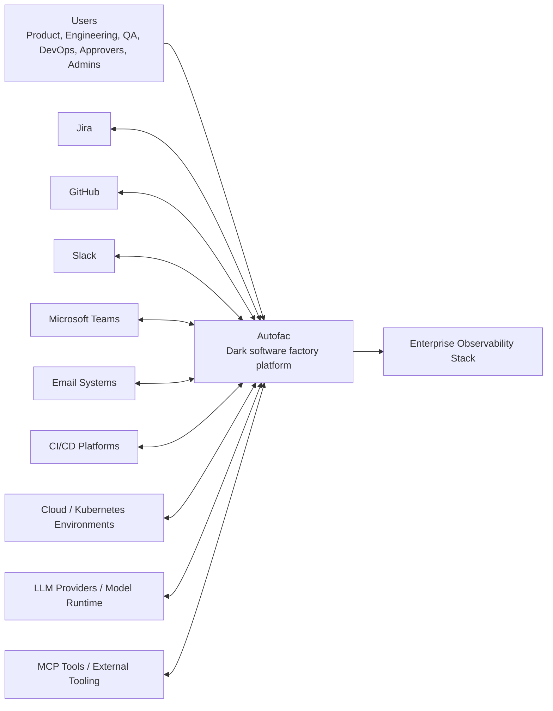
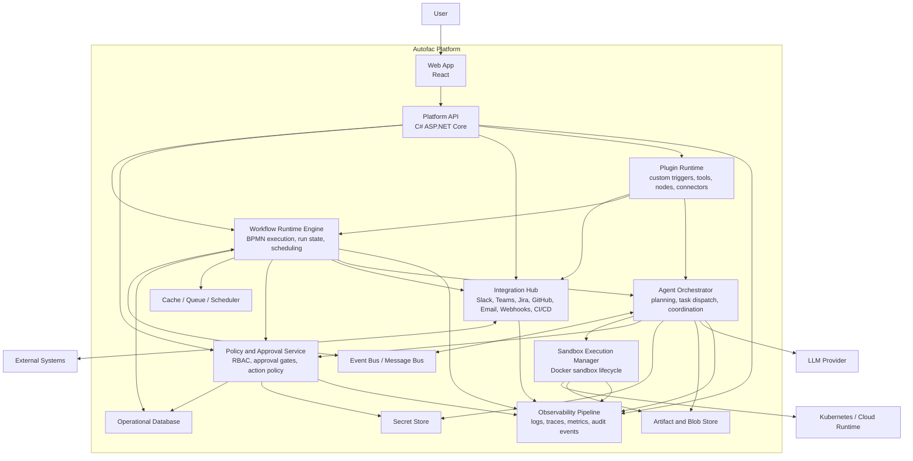
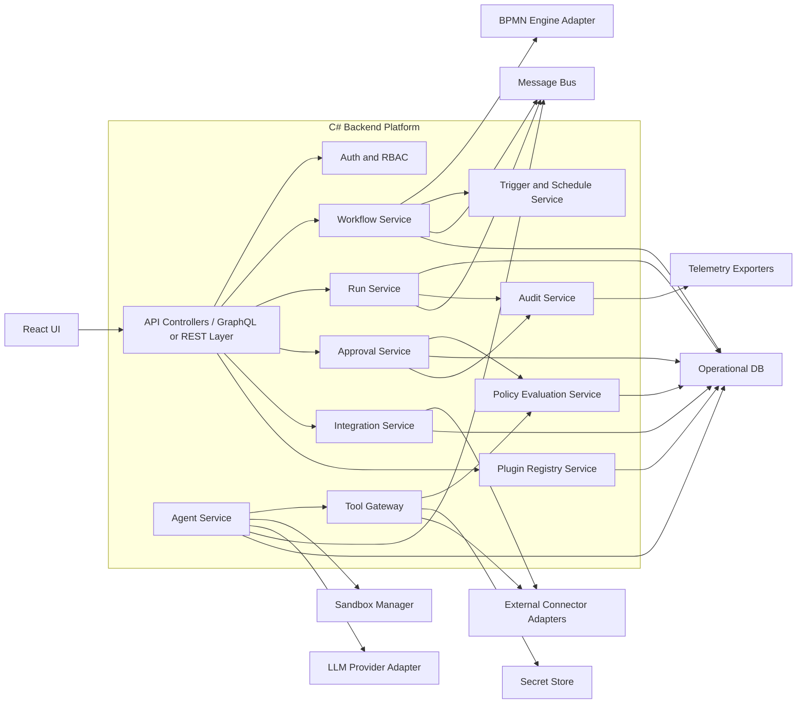
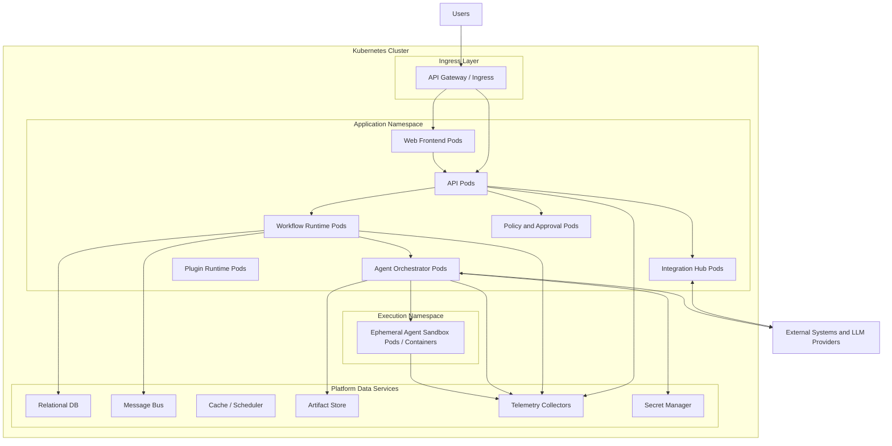

# Autofac Architecture Design

Version: Draft v0.1
Status: Working Draft
Related Document: `docs/functional-specification.md`

## 1. Purpose

This document defines the target architecture for Autofac based on the current Functional Specification Document.

The objective is to describe how Autofac should be structured as a secure, cloud-native, observable software factory platform that:
- models SDLC workflows in BPMN
- orchestrates agents as workflow executors
- integrates with enterprise systems
- enforces human approvals and policy gates
- provides full visibility across workflow and agent activity

This architecture is intended for product, engineering, platform, security, and operations stakeholders.

## 2. Architectural Goals

The architecture should satisfy the following product and technical goals:

1. Support configurable SDLC workflows using BPMN.
2. Treat agent execution as a first-class runtime concept.
3. Keep humans in control for high-impact actions.
4. Enforce policy, RBAC, and auditability across all actions.
5. Provide real-time observability for workflows, agents, tools, and integrations.
6. Support extensibility through plugins and connectors.
7. Support secure execution through sandboxing and isolation.
8. Run reliably in Docker and Kubernetes environments.

## 3. Architectural Principles

- Workflow-first: All automation is expressed as governed workflow execution.
- Human-governed autonomy: Agents can automate work, but policy and approval remain authoritative.
- Secure by default: Sensitive tools and production-facing actions are denied unless explicitly allowed.
- Observable by design: Every workflow transition, tool invocation, and agent action must be traceable.
- Extensible core: Integrations, tools, triggers, and custom BPMN nodes should plug into a stable platform contract.
- Cloud-native runtime: Stateless services, durable state stores, event-driven coordination, and containerized execution.

## 4. System Context

Autofac sits between human operators, enterprise systems, LLM providers, execution sandboxes, and delivery platforms.

### C4 Model Level 1: System Context

## 5. Container Architecture

Autofac should be designed as a set of cooperating platform services rather than a single monolith. The main architectural units are:

- React Web Application
- API Gateway / Backend API
- Workflow Runtime Engine
- Agent Orchestrator
- Sandbox Execution Manager
- Policy and Approval Services
- Integration Hub
- Plugin Runtime
- Observability Pipeline
- Persistent stores and event infrastructure

### C4 Model Level 2: Container Diagram

## 6. Container Responsibilities

### 6.1 Web App

Technology: React

Responsibilities:
- BPMN workflow designer UI
- Dashboard and operational monitoring
- Approval inbox and review workflow
- Workflow run inspection
- Integration and plugin configuration
- RBAC-aware navigation and administration views

### 6.2 Platform API

Technology: C# ASP.NET Core

Responsibilities:
- Primary entry point for UI and external clients
- Authentication and authorization enforcement
- Workflow CRUD APIs
- Run control APIs
- Approval APIs
- Integration configuration APIs
- Plugin administration APIs

### 6.3 Workflow Runtime Engine

Responsibilities:
- Execute BPMN workflows
- Maintain workflow state and transitions
- Process triggers and schedules
- Create and resume workflow runs
- Pause on approval gates
- Route task execution to agent or integration handlers
- Handle retries, compensation, and rollback controls

### 6.4 Agent Orchestrator

Responsibilities:
- Resolve task-to-agent assignment
- Load skill definitions
- Build execution context
- Invoke LLM-backed task execution
- Coordinate multi-agent workflows
- Track agent run state and outcomes
- Publish agent events to observability and audit streams

### 6.5 Sandbox Execution Manager

Responsibilities:
- Provision Docker-based agent sandboxes
- Apply runtime controls for file system, network, secrets, and CPU/memory
- Mount approved artifacts and workspaces
- Collect outputs, logs, traces, and artifacts
- Destroy or recycle isolated environments safely

### 6.6 Policy and Approval Service

Responsibilities:
- Enforce RBAC
- Evaluate action policies
- Manage approval queues and approval state
- Block or permit sensitive actions
- Record decision history
- Support AgentSecOps and MLOps guardrails

### 6.7 Integration Hub

Responsibilities:
- Inbound event ingestion
- Outbound notifications and commands
- Connector execution for Jira, GitHub, Slack, Teams, email, CI/CD, and cloud APIs
- Credential-aware external communication
- Connector health and retry handling

### 6.8 Plugin Runtime

Responsibilities:
- Register custom nodes, tools, connectors, and triggers
- Load extension metadata and execution contracts
- Isolate plugin behavior from core platform services
- Support safe extension points without core service rewrites

### 6.9 Observability Pipeline

Responsibilities:
- Collect logs, metrics, traces, and audit events
- Correlate workflow, agent, tool, and approval activity
- Feed dashboard views and external observability platforms
- Support incident analysis and compliance review

## 7. Component Architecture

The most important internal system boundary is the backend platform. Its core components should be clearly separated so the workflow model, execution model, and security model do not collapse into one service layer.

### C4 Model Level 3: Platform API and Runtime Components

## 8. Runtime Flow

### 8.1 Workflow Execution Lifecycle

1. A trigger is received from Slack, Teams, Jira, GitHub, webhook, email, schedule, or manual invocation.
2. The Integration Hub or Trigger Service validates the event and creates a workflow run.
3. The Workflow Runtime Engine loads the BPMN definition and starts execution.
4. When an Autofac Agent Task is reached, the Agent Orchestrator resolves agent profile, skills, tools, and policies.
5. The Sandbox Execution Manager provisions an isolated execution environment if required.
6. The agent performs the LLM task and invokes approved tools through the Tool Gateway.
7. Tool invocations are evaluated by policy before execution.
8. Outputs are stored as artifacts and execution events are emitted to observability streams.
9. If a Human Approval Task is reached, the run pauses until a decision is recorded.
10. Once approved, the workflow continues to the next task, test gate, PR action, or deployment action.
11. The run completes with status, logs, audit records, traces, and metrics preserved.

### 8.2 Example Delivery Flow

For the Jira-driven use case:
- Jira triggers requirement intake
- Analysis agent generates technical specification
- Human approves specification
- Planner or engineering agent creates implementation tasks
- Engineering agent writes code and creates PR
- Human reviews PR
- Tester agent runs validation
- DevOps agent deploys through CI/CD
- Platform records full end-to-end evidence

## 9. Data Architecture

Autofac requires a combination of transactional storage, event streams, artifacts, and secrets.

### Core Data Domains

- User and identity data
- Roles and permissions
- Workflow definitions and versions
- BPMN models and custom node metadata
- Workflow run state and history
- Agent definitions and skill manifests
- Approval records
- Tool policies and execution records
- Integration configurations
- Plugin manifests
- Telemetry metadata
- Artifacts and generated outputs

### Recommended Data Stores

- Relational database for operational data and workflow state
- Object/blob store for artifacts, attachments, generated files, logs, and trace exports
- Message bus for event-driven coordination
- Secret manager for integration credentials, API keys, and runtime secrets
- Search or analytics store for observability-heavy querying if needed at scale

## 10. Integration Architecture

Autofac should use a connector-based integration model.

### Connector Categories

- Trigger connectors
- Notification connectors
- Work management connectors
- Source control connectors
- CI/CD connectors
- Cloud action connectors
- MCP tool connectors

### Connector Design Rules

- Every connector must implement a standard execution contract.
- Every connector action must be policy-evaluable.
- Connector credentials must be externalized to secret storage.
- Connector execution must emit audit, logs, and traces.
- Connector failures must support retry, dead-letter, or operator intervention patterns.

## 11. Security Architecture

Security is central to Autofac because the platform can perform code generation, repository changes, infrastructure actions, and deployment activities.

### Security Controls

- SSO and enterprise identity integration
- Role-based access control
- Approval-based control for sensitive actions
- Policy-based tool authorization
- Secret isolation and least-privilege access
- Docker sandbox isolation
- Network egress restrictions for agents
- Audit logs for all user and agent actions
- Environment separation for dev, test, and production

### Sensitive Actions Requiring Policy and Approval

- Pull request merge
- Production environment changes
- Secret access
- Shell command execution with elevated privileges
- External notifications to regulated audiences
- Cloud API calls with production scope
- Deployment actions

## 12. Observability Architecture

Autofac must support logging, tracing, and monitoring as first-class capabilities.

### Telemetry Types

- Workflow run logs
- Agent execution logs
- Tool invocation records
- Connector request and response logs
- Approval decision logs
- Distributed traces
- Metrics for latency, failure rate, throughput, retries, and approval wait time
- Audit events for governance review

### Observability Objectives

- Understand what happened
- Understand who or what initiated it
- Understand which tools and policies were involved
- Understand why an action was blocked, failed, or retried
- Correlate technical telemetry with workflow business state

## 13. Deployment Architecture

Autofac should be deployed as a cloud-native platform on Kubernetes.

### C4 Model Level 4 Style Deployment View

## 14. Technology Direction

### Frontend

- React for the application shell and workflow UI
- Open source BPMN modeler extended with Autofac custom components
- Real-time operational dashboards for workflow and agent monitoring

### Backend

- C# with ASP.NET Core
- BPMN engine integration through an adapter layer
- Background services for workflow scheduling, run processing, and event handling
- Policy, approval, orchestration, and integration services separated by responsibility

### Runtime and Infrastructure

- Docker for agent sandboxing
- Kubernetes for orchestration and scaling
- Message bus for asynchronous coordination
- Centralized telemetry pipeline for logs, metrics, traces, and audit

### 14.1 BPMN Engine Evaluation and Selection

Autofac needs two distinct BPMN capabilities:
- a React-friendly modeling experience that can be extended with Autofac custom components
- a production-grade execution engine that can orchestrate long-running workflows, timers, approvals, and agent-driven service tasks

Because the platform backend is C# and the frontend is React, the BPMN engine should be treated as a dedicated orchestration runtime behind an adapter boundary rather than embedded directly in the application backend.

#### Candidate Comparison

| Candidate | Strengths | Risks / Constraints | Fit for Autofac |
| --- | --- | --- | --- |
| Camunda 8 with Zeebe | Current cloud-native orchestration engine; designed for distributed, high-throughput execution; official BPMN modeling and execution docs are current; service-task and job-worker model aligns well with agent tasks; clear support for self-managed deployment | BPMN support is a defined subset and models must target Camunda 8 specifically; introduces a separate orchestration runtime rather than an embedded library | Strongest overall fit for Autofac's agent orchestration, event-driven execution, and Kubernetes-first direction |
| Flowable OSS | Mature open source BPMN engine; supports BPMN 2.0 deployments, process instances, history, REST API, and web modeler/admin/task apps; broad BPMN and extension support | Java-first engine designed to be embedded or hosted in Java environments; less naturally aligned to a C#-centric platform boundary; cloud-native horizontal scale story is less central in its positioning than Zeebe | Good fallback and strong classical BPM/workflow option, especially if richer BPMN breadth becomes more important than distributed orchestration |
| jBPM / Apache KIE stack | Long BPM heritage and broader business automation ecosystem | Current project positioning is under Apache KIE incubation, which adds ecosystem and long-term roadmap uncertainty for a new greenfield platform | Not recommended for Autofac at this stage |

#### Evaluation Criteria

Autofac's engine choice should optimize for:
- React-compatible BPMN modeling and custom node extensibility
- clean separation from the C# API layer
- long-running workflow support
- timer, message, and human-approval orchestration
- service-task execution that maps cleanly to Autofac agents
- strong observability and production operations on Kubernetes
- low migration risk between MVP and long-term platform evolution

#### Decision

Autofac should use Camunda 8 as the strategic BPMN execution engine.

This recommendation is based on the following architectural fit:
- Camunda 8's Zeebe runtime is explicitly positioned as the process automation engine for distributed execution and low-latency scale.
- Its job-worker execution pattern maps naturally to Autofac agent tasks, where agents act as controlled workers rather than code embedded inside the engine.
- The Camunda ecosystem also aligns well with the React-side BPMN modeling path because the broader `bpmn-js` and Camunda modeler ecosystem is already widely used for browser-based BPMN experiences.
- Treating Camunda 8 as a dedicated orchestration runtime fits a C# platform better than embedding a Java engine directly into the core backend.

#### Short-Term Strategy

For MVP and the first implementation phase:
- use a React BPMN designer based on `bpmn-js`
- model for the Camunda 8 execution subset only
- run Camunda 8 Self-Managed as a separate orchestration service in Kubernetes
- keep Autofac custom semantics in extension metadata and task configuration, not in engine-forked BPMN behavior
- implement Autofac agent tasks as Camunda service-task or job-worker style execution adapters behind the Agent Orchestrator

This keeps the first release practical and avoids a future engine migration between MVP and scale-out production.

#### Long-Term Strategy

For the longer-term platform:
- keep Camunda 8 as the default orchestration engine for production workflow execution
- preserve an internal `Workflow Engine Adapter` boundary so Autofac business services do not depend directly on vendor-specific engine APIs
- isolate engine-specific BPMN extensions to the modeling and execution adapter layer
- evaluate Flowable only as a secondary engine option if future requirements demand broader BPMN construct coverage or a more traditional BPM use case than Autofac's primary agent-orchestration model

In other words, the long-term strategy is not "switch engines later"; it is "standardize on Camunda 8, but contain engine coupling so Autofac retains optionality."

#### Explicit Non-Recommendations

- Do not use different engines for short-term and long-term production execution. BPMN models are engine-specific enough that this would create avoidable migration cost.
- Do not embed a Java BPMN engine directly into the C# backend. The cross-runtime coupling would complicate deployment, upgrades, and operational ownership.
- Do not overuse vendor-specific BPMN extensions in the core domain model. Keep Autofac concepts mapped through its own workflow abstraction.

#### Impact on the Existing Architecture

The architecture in this document should therefore be interpreted as:
- `Workflow Runtime Engine` = Camunda 8 Self-Managed orchestration runtime behind an Autofac adapter
- `Workflow Service` and `BPMN Engine Adapter` = Autofac-owned layer that translates platform concepts to engine-specific deployment and runtime APIs
- `Agent Orchestrator` = the controlled worker execution layer for Autofac agent tasks
- `React BPMN UI` = `bpmn-js`-based editor with Autofac custom components constrained to the supported execution model

## 15. Key Architectural Decisions

### Decision 1: BPMN-Centric Orchestration

Why:
- aligns with business-readable workflow modeling
- supports auditability and lifecycle visibility
- allows custom Autofac nodes for agent and governance behavior
- now resolved with Camunda 8 as the default execution engine behind an adapter layer

### Decision 2: Separate Workflow Engine and Agent Orchestrator

Why:
- keeps process state management separate from AI task execution
- avoids coupling BPMN semantics to LLM runtime concerns
- allows independent scaling and evolution

### Decision 3: Tool Gateway with Policy Enforcement

Why:
- creates a single control point for risky actions
- simplifies logging and auditability
- supports consistent approval and authorization rules

### Decision 4: Sandbox-Based Agent Runtime

Why:
- reduces blast radius for agent execution
- supports reproducible task environments
- helps enforce operational and compliance boundaries

### Decision 5: Connector and Plugin Architecture

Why:
- supports enterprise integration breadth
- preserves a stable core platform
- reduces custom-code pressure on central services

## 16. Risks and Tradeoffs

- BPMN flexibility can increase workflow complexity for non-technical users.
- Fine-grained policy and approval systems can reduce execution speed if overused.
- Sandbox isolation improves safety but increases runtime overhead.
- Multi-agent communication introduces coordination and observability complexity.
- Plugin extensibility increases platform flexibility but expands security review scope.

## 17. Recommended MVP Architecture

For MVP, the architecture should focus on the smallest coherent slice:

- React web app
- C# Platform API
- BPMN workflow runtime
- Agent orchestrator
- Docker sandbox execution
- Policy and approval service
- Jira and GitHub connectors
- Basic CI/CD connector
- Observability pipeline with run logs, traces, and audit
- Kubernetes-ready deployment topology

MVP should avoid overbuilding:
- start with a small set of custom BPMN nodes
- support a minimal connector framework first
- implement essential approvals and policy gates before advanced self-improvement
- treat plugin isolation as a controlled extension path, not an open execution surface

## 18. Open Architecture Questions

1. Should workflow state be persisted directly by the BPMN engine or through an Autofac run abstraction?
2. What message bus should be used for agent coordination and event propagation?
3. How should plugin execution be isolated from core platform services?
4. What is the first supported secret management provider?
5. Which telemetry platform should be the default reference implementation?
6. How much agent-to-agent autonomy is acceptable in MVP versus later phases?

## 19. Architecture References

The BPMN engine recommendation above is based on current primary-source documentation reviewed on June 13, 2026:

- Camunda 8 BPMN modeling and coverage docs: https://docs.camunda.io/docs/components/modeler/bpmn/
- Camunda 8 BPMN coverage: https://docs.camunda.io/docs/components/modeler/bpmn/bpmn-coverage/
- Camunda 8 Zeebe overview: https://docs.camunda.io/docs/components/zeebe/zeebe-overview/
- Flowable open source BPMN getting started and constructs docs: https://www.flowable.com/open-source/docs/bpmn/ch02-GettingStarted and https://www.flowable.com/open-source/docs/bpmn/ch07b-BPMN-Constructs/
- Apache KIE project page for jBPM ecosystem status: https://kie.apache.org

## 20. Summary

Autofac should be implemented as a workflow-first, cloud-native orchestration platform with strong separation between workflow state management, agent execution, policy enforcement, integration handling, and observability.

The C4 views in this document show Autofac as a governed execution fabric sitting between human operators, enterprise systems, LLM-based agents, and deployment infrastructure. Its strength comes from combining BPMN process clarity, secure agent runtime controls, and complete operational visibility in one software factory platform.
