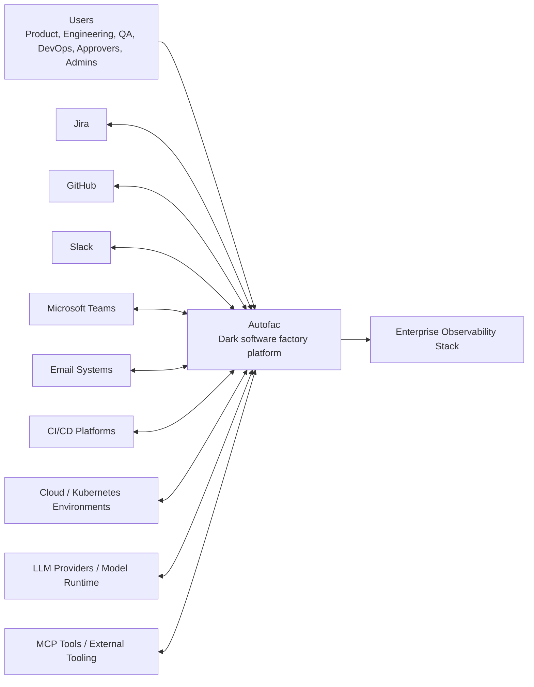
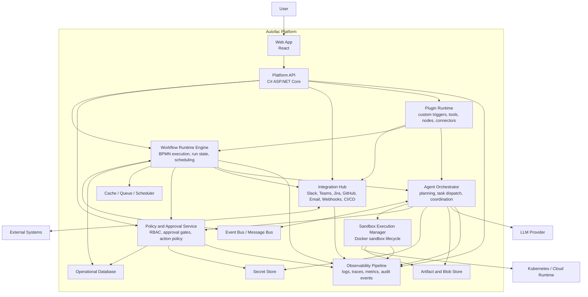
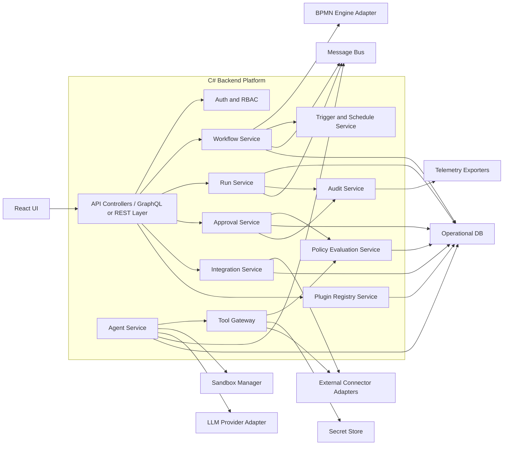
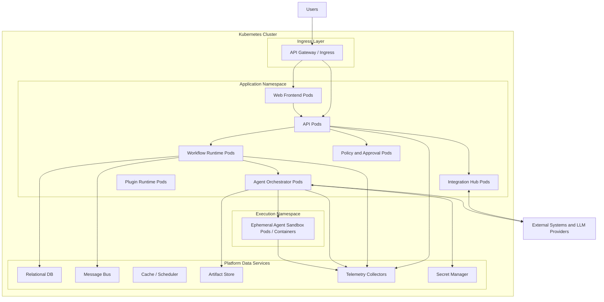

# Autofac Architecture Design

Version: Draft v0.2
Status: Working Draft
Last reviewed: 2026-06-17
Related Document: `docs/functional-specification.md`

> **Reader's note.** Sections 1–20 describe the **target architecture** (the north star). Sections 21–24 were added after a full source review on 2026-06-15 and describe the **as-built reality**, the **gap analysis**, the **implementation roadmap**, and **future enhancements**. Where the target and the as-built state diverge, Section 21 is authoritative for "what exists today."

## 1. Purpose

This document defines the target architecture for Autofac based on the current Functional Specification Document.

The objective is to describe how Autofac should be structured as a secure, cloud-native, observable software factory platform that:
- models SDLC workflows in BPMN
- orchestrates agents as workflow executors
- integrates with enterprise systems
- enforces human approvals and policy gates
- provides full visibility across workflow and agent activity

This architecture is intended for product, engineering, platform, security, and operations stakeholders.

## 2. Architectural Goals

The architecture should satisfy the following product and technical goals:

1. Support configurable SDLC workflows using BPMN.
2. Treat agent execution as a first-class runtime concept.
3. Keep humans in control for high-impact actions.
4. Enforce policy, RBAC, and auditability across all actions.
5. Provide real-time observability for workflows, agents, tools, and integrations.
6. Support extensibility through plugins and connectors.
7. Support secure execution through sandboxing and isolation.
8. Run reliably in Docker and Kubernetes environments.

## 3. Architectural Principles

- Workflow-first: All automation is expressed as governed workflow execution.
- Human-governed autonomy: Agents can automate work, but policy and approval remain authoritative.
- Secure by default: Sensitive tools and production-facing actions are denied unless explicitly allowed.
- Observable by design: Every workflow transition, tool invocation, and agent action must be traceable.
- Extensible core: Integrations, tools, triggers, and custom BPMN nodes should plug into a stable platform contract.
- Cloud-native runtime: Stateless services, durable state stores, event-driven coordination, and containerized execution.

## 4. System Context

Autofac sits between human operators, enterprise systems, LLM providers, execution sandboxes, and delivery platforms.

### C4 Model Level 1: System Context



## 5. Container Architecture

Autofac should be designed as a set of cooperating platform services rather than a single monolith. The main architectural units are:

- React Web Application
- API Gateway / Backend API
- Workflow Runtime Engine
- Agent Orchestrator
- Sandbox Execution Manager
- Policy and Approval Services
- Integration Hub
- Plugin Runtime
- Observability Pipeline
- Persistent stores and event infrastructure

### C4 Model Level 2: Container Diagram



## 6. Container Responsibilities

### 6.1 Web App

Technology: React

Responsibilities:
- BPMN workflow designer UI
- Dashboard and operational monitoring
- Approval inbox and review workflow
- Workflow run inspection
- Integration and plugin configuration
- RBAC-aware navigation and administration views

### 6.2 Platform API

Technology: C# ASP.NET Core

Responsibilities:
- Primary entry point for UI and external clients
- Authentication and authorization enforcement
- Workflow CRUD APIs
- Run control APIs
- Approval APIs
- Integration configuration APIs
- Plugin administration APIs

### 6.3 Workflow Runtime Engine

Responsibilities:
- Execute the Autofac-supported BPMN subset through the default Postgres-backed runtime
- Maintain workflow state and transitions through the engine adapter
- Process triggers and schedules
- Create and resume workflow runs
- Pause on approval gates
- Route task execution to agent or integration handlers
- Handle retries, compensation, and rollback controls

Architecture decision: Autofac is BPMN-centric, but the default runtime is the bounded Postgres-backed Autofac runtime. Camunda 8 is retained as an optional enterprise adapter, not the production default. See `docs/decisions/ADR-002-use-bpmn-centric-autofac-runtime-by-default.md`.

### 6.4 Agent Orchestrator

Responsibilities:
- Resolve task-to-agent assignment
- Load skill definitions
- Build execution context
- Invoke LLM-backed task execution
- Coordinate multi-agent workflows
- Track agent run state and outcomes
- Publish agent events to observability and audit streams

**Run context (inter-task data flow, Phase A).** Each run owns a key/value
context bag (`workflow_run_context`). It is seeded at run start with the
triggering issue (`input.title`, `input.body`, `input.external_url`, …) and
appended after every completed service task with that task's primary output
(`output.<nodeId>`). During prompt assembly the orchestrator loads the bag and
exposes it both as template variables (e.g. `{{input.body}}`,
`{{output.WriteRequirements}}`) and as a rendered `run_context` prompt section,
so a later agent (architect, analyst, …) can build on earlier agents' output.
See issue isartor-ai/autofac-private#89.

SDLC agent profiles registered in `AgentRegistry`: `business-analyst`,
`solution-architect`, `technical-analyst`, `implementation-engineer`,
`senior-code-reviewer` (plus the existing deploy/security/infra/test/github agents).

### 6.5 Sandbox Execution Manager

Responsibilities:
- Provision Docker-based agent sandboxes
- Apply runtime controls for file system, network, secrets, and CPU/memory
- Mount approved artifacts and workspaces
- Collect outputs, logs, traces, and artifacts
- Destroy or recycle isolated environments safely

### 6.6 Policy and Approval Service

Responsibilities:
- Enforce RBAC
- Evaluate action policies
- Manage approval queues and approval state
- Block or permit sensitive actions
- Record decision history
- Support AgentSecOps and MLOps guardrails

### 6.7 Integration Hub

Responsibilities:
- Inbound event ingestion
- Outbound notifications and commands
- Connector execution for Jira, GitHub, Slack, Teams, email, CI/CD, and cloud APIs
- Credential-aware external communication
- Connector health and retry handling

### 6.8 Plugin Runtime

Responsibilities:
- Register custom nodes, tools, connectors, and triggers
- Load extension metadata and execution contracts
- Isolate plugin behavior from core platform services
- Support safe extension points without core service rewrites

### 6.9 Observability Pipeline

Responsibilities:
- Collect logs, metrics, traces, and audit events
- Correlate workflow, agent, tool, and approval activity
- Feed dashboard views and external observability platforms
- Support incident analysis and compliance review

## 7. Component Architecture

The most important internal system boundary is the backend platform. Its core components should be clearly separated so the workflow model, execution model, and security model do not collapse into one service layer.

### C4 Model Level 3: Platform API and Runtime Components



## 8. Runtime Flow

### 8.1 Workflow Execution Lifecycle

1. A trigger is received from Slack, Teams, Jira, GitHub, webhook, email, schedule, or manual invocation.
2. The Integration Hub or Trigger Service validates the event and creates a workflow run.
3. The Workflow Runtime Engine loads the BPMN definition and starts execution.
4. When an Autofac Agent Task is reached, the Agent Orchestrator resolves agent profile, skills, tools, and policies.
5. The Sandbox Execution Manager provisions an isolated execution environment if required.
6. The agent performs the LLM task and invokes approved tools through the Tool Gateway.
7. Tool invocations are evaluated by policy before execution.
8. Outputs are stored as artifacts and execution events are emitted to observability streams.
9. If a Human Approval Task is reached, the run pauses until a decision is recorded.
10. Once approved, the workflow continues to the next task, test gate, PR action, or deployment action.
11. The run completes with status, logs, audit records, traces, and metrics preserved.

### 8.2 Example Delivery Flow

For the Jira-driven use case:
- Jira triggers requirement intake
- Analysis agent generates technical specification
- Human approves specification
- Planner or engineering agent creates implementation tasks
- Engineering agent writes code and creates PR
- Human reviews PR
- Tester agent runs validation
- DevOps agent deploys through CI/CD
- Platform records full end-to-end evidence

## 9. Data Architecture

Autofac requires a combination of transactional storage, event streams, artifacts, and secrets.

### Core Data Domains

- User and identity data
- Roles and permissions
- Workflow definitions and versions
- BPMN models and custom node metadata
- Workflow run state and history
- Agent definitions and skill manifests
- Approval records
- Tool policies and execution records
- Integration configurations
- Plugin manifests
- Telemetry metadata
- Artifacts and generated outputs

### Recommended Data Stores

- Relational database for operational data and workflow state
- Object/blob store for artifacts, attachments, generated files, logs, and trace exports
- Message bus for event-driven coordination
- Secret manager for integration credentials, API keys, and runtime secrets
- Search or analytics store for observability-heavy querying if needed at scale

## 10. Integration Architecture

Autofac should use a connector-based integration model.

### Connector Categories

- Trigger connectors
- Notification connectors
- Work management connectors
- Source control connectors
- CI/CD connectors
- Cloud action connectors
- MCP tool connectors

### Connector Design Rules

- Every connector must implement a standard execution contract.
- Every connector action must be policy-evaluable.
- Connector credentials must be externalized to secret storage.
- Connector execution must emit audit, logs, and traces.
- Connector failures must support retry, dead-letter, or operator intervention patterns.

## 11. Security Architecture

Security is central to Autofac because the platform can perform code generation, repository changes, infrastructure actions, and deployment activities.

### Security Controls

- SSO and enterprise identity integration
- Role-based access control
- Approval-based control for sensitive actions
- Policy-based tool authorization
- Secret isolation and least-privilege access
- Docker sandbox isolation
- Network egress restrictions for agents
- Audit logs for all user and agent actions
- Environment separation for dev, test, and production

### Sensitive Actions Requiring Policy and Approval

- Pull request merge
- Production environment changes
- Secret access
- Shell command execution with elevated privileges
- External notifications to regulated audiences
- Cloud API calls with production scope
- Deployment actions

## 12. Observability Architecture

Autofac must support logging, tracing, and monitoring as first-class capabilities.

### Telemetry Types

- Workflow run logs
- Agent execution logs
- Tool invocation records
- Connector request and response logs
- Approval decision logs
- Distributed traces
- Metrics for latency, failure rate, throughput, retries, and approval wait time
- Audit events for governance review

### Observability Objectives

- Understand what happened
- Understand who or what initiated it
- Understand which tools and policies were involved
- Understand why an action was blocked, failed, or retried
- Correlate technical telemetry with workflow business state

## 13. Deployment Architecture

Autofac should be deployed as a cloud-native platform on Kubernetes.

### C4 Model Level 4 Style Deployment View



## 14. Technology Direction

### Frontend

- React for the application shell and workflow UI
- Open source BPMN modeler extended with Autofac custom components
- Real-time operational dashboards for workflow and agent monitoring

### Backend

- C# with ASP.NET Core
- BPMN engine integration through an adapter layer
- Background services for workflow scheduling, run processing, and event handling
- Policy, approval, orchestration, and integration services separated by responsibility

### Runtime and Infrastructure

- Docker for agent sandboxing
- Kubernetes for orchestration and scaling
- Message bus for asynchronous coordination
- Centralized telemetry pipeline for logs, metrics, traces, and audit

### 14.1 BPMN Runtime Strategy

Autofac needs two distinct BPMN capabilities:
- a React-friendly modeling experience that can be extended with Autofac custom components
- a reliable runtime that executes the governed SDLC workflow subset used by Autofac templates

These capabilities are deliberately separated. BPMN remains the workflow artifact, import/export format, and governance language. Runtime choice is infrastructure behind the Autofac workflow boundary.

#### Candidate Comparison

| Candidate | Strengths | Risks / Constraints | Fit for Autofac |
| --- | --- | --- | --- |
| Autofac bounded runtime | Native .NET/Postgres deployment; already integrated with run state, context, approvals, audit, outbox, timers, and recovery; simplest self-hosted path for German companies | Must remain explicitly scoped to Autofac-supported SDLC templates; not a general BPMN engine | Default runtime for MVP, pilots, and first self-hosted deployments |
| Camunda 8 with Zeebe | Mature orchestration runtime; service-task/job-worker model aligns with agent tasks; strong user task, timer, retry, and incident concepts | Adds separate production runtime, licensing and operations questions, Camunda-specific BPMN projection, and installation complexity | Optional enterprise adapter when a customer requires or already operates Camunda |
| Flowable OSS | Mature classical BPM engine; broad BPMN support; strong self-hosted story in Java environments | Java-first runtime and separate operational surface; not aligned with simple .NET/Postgres default deployment | Fallback only if richer BPMN breadth becomes a customer requirement |
| Embedded third-party workflow engine | Could reduce custom runtime maintenance while keeping deployment simpler than a full external BPM platform | No current option clearly beats the existing Autofac runtime for .NET, Postgres, BPMN artifact continuity, and template-first strategy | Deferred evaluation |

#### Evaluation Criteria

Autofac's engine choice should optimize for:
- React-compatible BPMN modeling and custom node extensibility
- simple self-hosted deployment with PostgreSQL
- immediate usability for German companies with data residency requirements
- bounded long-running workflow support for SDLC templates
- timer and human-approval orchestration
- service-task execution that maps cleanly to Autofac agents
- run observability, auditability, and evidence capture
- low migration risk between MVP and long-term platform evolution

#### Decision (Revised - 2026-06-17)

**Autofac remains BPMN-centric, but Camunda 8 is no longer the default production runtime.** The default runtime is the bounded Postgres-backed Autofac runtime, executing the supported BPMN subset required by curated SDLC templates. Camunda 8 is an optional enterprise adapter behind the runtime boundary.

Rationale:
- Autofac's strategic value is SDLC semantics, real agent execution, policy, evidence, approvals, integrations, audit, and operator UX.
- Company SDLC processes are usually stable enough to start from a small catalog of governed templates rather than arbitrary BPMN.
- The existing Postgres/outbox runtime already covers the near-term needs for durable runs, recovery, timers, approvals, and run context without adding a separate stateful engine.
- A simple .NET/Postgres self-hosted deployment better matches first German customer adoption than a required Camunda 8 cluster.
- The adapter boundary remains useful so Camunda can be enabled when a customer requires it.

#### Engine Strategy

- Default runtime: Autofac bounded runtime backed by PostgreSQL, outbox workers, run events, checkpoints, and run context.
- Supported BPMN subset: `startEvent`, `serviceTask`, `userTask`, `exclusiveGateway`, `parallelGateway`, `intermediateCatchEvent`, `boundaryEvent`, `endEvent`, and sequence flows required by curated SDLC templates.
- Unsupported BPMN constructs must fail validation for the default runtime instead of being interpreted partially.
- Optional runtime: Camunda 8 adapter, enabled only through explicit configuration and customer need.
- The adapter boundary stays mandatory so default and optional enterprise runtimes can coexist without changing product-level workflow APIs.
- Runtime extension pressure should be handled through agent profiles, tools, connectors, policies, evidence handlers, and templates before expanding BPMN semantics.

#### Impact on the Architecture

- `Workflow Runtime Engine` = bounded Autofac runtime by default, reached through product workflow services
- `BPMN Engine Adapter` = runtime boundary for optional engines such as Camunda 8
- `React BPMN UI` = template-first SDLC builder plus advanced `bpmn-js` editor; BPMN XML remains the design artifact
- `WorkflowInstanceEngine` = default runtime until a measured re-decision trigger requires a different engine

## 15. Key Architectural Decisions

### Decision 1: BPMN-Centric Orchestration with Bounded Autofac Runtime

Why:
- aligns with business-readable workflow modeling
- supports auditability and lifecycle visibility
- allows custom Autofac nodes for agent and governance behavior
- keeps first deployment simple: .NET service plus PostgreSQL, with Camunda 8 available only as an optional enterprise adapter
- constrains runtime scope to curated SDLC templates instead of arbitrary BPMN execution

### Decision 2: Separate Workflow Engine and Agent Orchestrator

Why:
- keeps process state management separate from AI task execution
- avoids coupling BPMN semantics to LLM runtime concerns
- allows independent scaling and evolution

### Decision 3: Tool Gateway with Policy Enforcement

Why:
- creates a single control point for risky actions
- simplifies logging and auditability
- supports consistent approval and authorization rules

### Decision 4: Sandbox-Based Agent Runtime

Why:
- reduces blast radius for agent execution
- supports reproducible task environments
- helps enforce operational and compliance boundaries

### Decision 5: Connector and Plugin Architecture

Why:
- supports enterprise integration breadth
- preserves a stable core platform
- reduces custom-code pressure on central services

## 16. Risks and Tradeoffs

- BPMN flexibility can increase workflow complexity for non-technical users.
- Fine-grained policy and approval systems can reduce execution speed if overused.
- Sandbox isolation improves safety but increases runtime overhead.
- Multi-agent communication introduces coordination and observability complexity.
- Plugin extensibility increases platform flexibility but expands security review scope.

## 17. Recommended MVP Architecture

For MVP, the architecture should focus on the smallest coherent slice:

- React web app
- C# Platform API
- BPMN workflow runtime
- Agent orchestrator
- Docker sandbox execution
- Policy and approval service
- Jira and GitHub connectors
- Basic CI/CD connector
- Observability pipeline with run logs, traces, and audit
- Kubernetes-ready deployment topology

MVP should avoid overbuilding:
- start with a small set of custom BPMN nodes
- support a minimal connector framework first
- implement essential approvals and policy gates before advanced self-improvement
- treat plugin isolation as a controlled extension path, not an open execution surface

## 18. Open Architecture Questions

1. Should workflow state be persisted directly by the BPMN engine or through an Autofac run abstraction?
2. What message bus should be used for agent coordination and event propagation?
3. How should plugin execution be isolated from core platform services?
4. What is the first supported secret management provider?
5. Which telemetry platform should be the default reference implementation?
6. How much agent-to-agent autonomy is acceptable in MVP versus later phases?

## 19. Architecture References

The BPMN engine recommendation above is based on current primary-source documentation reviewed on June 13, 2026:

- Camunda 8 BPMN modeling and coverage docs: https://docs.camunda.io/docs/components/modeler/bpmn/
- Camunda 8 BPMN coverage: https://docs.camunda.io/docs/components/modeler/bpmn/bpmn-coverage/
- Camunda 8 Zeebe overview: https://docs.camunda.io/docs/components/zeebe/zeebe-overview/
- Flowable open source BPMN getting started and constructs docs: https://www.flowable.com/open-source/docs/bpmn/ch02-GettingStarted and https://www.flowable.com/open-source/docs/bpmn/ch07b-BPMN-Constructs/
- Apache KIE project page for jBPM ecosystem status: https://kie.apache.org

## 20. Summary

Autofac should be implemented as a workflow-first, cloud-native orchestration platform with strong separation between workflow state management, agent execution, policy enforcement, integration handling, and observability.

The C4 views in this document show Autofac as a governed execution fabric sitting between human operators, enterprise systems, LLM-based agents, and deployment infrastructure. Its strength comes from combining BPMN process clarity, secure agent runtime controls, and complete operational visibility in one software factory platform.

---

## 21. Current Implementation Status (As-Built)

This section reflects the codebase as of 2026-06-15. It is the authoritative description of what exists today.

### 21.1 Solution Topology

The backend is a layered C# solution (`net9.0`) with clean dependency direction (Domain ← Application ← Infrastructure/Workflows/Agents ← Api):

| Project | Role | Maturity |
| --- | --- | --- |
| `Autofac.Domain` | Persistence entities, agent-runtime contracts, policy decisions | Solid |
| `Autofac.Application` | Run orchestration service, authoring service, observability + run contracts | Solid |
| `Autofac.Workflows` | In-process BPMN engine, BPMN validator, engine-adapter boundary | Solid; graph-based traversal, sequence flow parsing |
| `Autofac.Agents` | Agent orchestrator, tool gateway, hook gateway, MCP session, skills, prompt assembler | Rich, but execution is simulated |
| `Autofac.AgentSecOps` | Rule-based policy evaluation service | MVP rules, hardcoded |
| `Autofac.Sandboxes` | Docker sandbox executor (Docker.DotNet) | Real container lifecycle; placeholder workload |
| `Autofac.Integrations` | `IConnector`/`ConnectorBase` abstraction; GitHub, Jira (ADF comments), Slack, Teams connectors; `IConnectorRegistry`; per-connector policy gate, audit, metrics, and OTel spans | Solid (Phase E) |
| `Autofac.Infrastructure` | EF Core + PostgreSQL (Npgsql), repositories, runtime store, 8 migrations | Solid |
| `Autofac.Storage` | Artifact storage abstraction; local filesystem + S3 (`AWSSDK.S3`) drivers | Phase E: S3 added |
| `Autofac.Observability` | Prometheus metrics, JSON console logs, correlation middleware, OTel tracing (`WithTracing` + OTLP exporter), `IWorkflowTracer`/`ISpan` abstraction, Jaeger via docker-compose | Metrics + tracing (Phase F) |
| `Autofac.Api` | ASP.NET Core controllers, contract mapping, OpenAPI | Solid; unauthenticated |

Frontend (`web/`, React + Vite + bpmn-js): `WorkflowDesigner`, `RunBoard`, `RunDetail`, `ApprovalsDashboard`, `Login`, plus a component library and ~8 Vitest integration/e2e suites. The `WorkflowDesigner` view embeds a full `BpmnModeler` component (bpmn-js v17) with Autofac moddle extension (`autofac:AgentTask`, `autofac:ApprovalTask`) — extension metadata is serialized directly into BPMN XML via `modeling.updateModdleProperties`. Custom `additionalModules` add a drag-and-drop palette, CSS canvas markers, and a `bpmn-js-properties-panel` sidebar for editing all Autofac-specific fields. A `__mocks__/BpmnModeler.tsx` stub allows Vitest to run without jsdom SVG layout.

### 21.2 What Actually Works End-to-End

- **BPMN authoring → validation → publish** via `WorkflowAuthoringService` and `BpmnWorkflowValidator`, exposed through `WorkflowsController` and the bpmn-js designer. The designer provides a drag-and-drop canvas with Autofac-specific palette entries ("Agent Task", "Approval Gate"), a properties panel sidebar for editing `autofac:agentTask` and `autofac:ApprovalTask` extension elements, canvas accent markers for visual identification, and overlay badges that surface backend validation errors directly on the relevant BPMN elements. Extension metadata round-trips natively through `bpmnXml` — no side-channel JSON.
- **Workflow execution today** runs via the in-process `WorkflowInstanceEngine` (`EngineId => "in-process"`): start events, service tasks (retry + boundary timeout), user/approval tasks, exclusive gateways (condition evaluation), parallel gateways (sequential branches with fork/join detection), intermediate/boundary timer events, and end events. The engine uses **graph-based traversal**: `BpmnSequenceFlow` elements are parsed and stored; when absent (tests), flows are inferred from node order. Checkpoints are keyed by node ID (not list index) and are written as event-sourced `checkpoint_saved` events, enabling `ResumeAsync` and `RecoverAsync`. This is now the default runtime foundation for MVP and pilots, constrained to curated Autofac SDLC templates rather than arbitrary BPMN execution.
- **Policy enforcement** at the Tool Gateway (`ToolGateway`): allow/deny lists, permission-level checks, input validation, and `PolicyEvaluationService` evaluation before every tool call — the single control point envisioned in Decision 3.
- **Agent runtime assembly**: skill resolution from markdown manifests (`SkillRepository`/`MarkdownSkillLoader`), prompt assembly with full prompt snapshots, hook execution (`HookGateway` with `before/after_agent_run`), MCP tool sessions (`McpToolSessionFactory`), and a complete `AgentRuntimeSnapshot` persisted per step.
- **GitHub delivery**: real branch creation, marker-file commit, and pull-request creation via `GitHubConnector`.
- **Approvals + audit**: approval requests created at user-task gates, decided through `ApprovalsController`, with run resume on approval and `AuditRecord` written for governance.
- **Inbound triggers**: GitHub/Jira webhook ingestion with HMAC signature validation and tag-based workflow routing (`TagBasedTriggerRouter`).
- **Observability**: workflow/step/approval/webhook metrics on `/metrics` (Prometheus), structured JSON logs with scoped `RunId`/`WorkflowId`/`Operation`, correlation-ID propagation, and **distributed tracing** via OTel `WithTracing` + OTLP to Jaeger (`Autofac.Workflows` `ActivitySource`; spans on engine start/resume/recover and every connector call).
- **Connectors**: `IConnector`/`ConnectorBase` policy-gated abstraction; GitHub, Jira (Atlassian Document Format), Slack, Teams connectors; data-driven `IPolicyRuleStore` with `FilePolicyRuleStore` (YAML-backed) and `InMemoryPolicyRuleStore` (tests); S3 artifact driver.
- **Persistence + deployment**: PostgreSQL via EF Core migrations; `docker-compose` brings up Postgres + migrate + api + web + Jaeger; **Helm chart** (`deploy/helm/autofac`) deploys api (HPA 2→8), worker (HPA 2→6), web, Postgres StatefulSet, RBAC for sandbox namespace; Grafana dashboard at `deploy/grafana/dashboards/workflow-overview.json`; Prometheus alert rules at `deploy/prometheus/alerts.yml`.

### 21.3 Honest Limitations

These are the load-bearing gaps between the running system and the target architecture:

1. **Agent execution is simulated.** `AgentOrchestrator.BuildSimulatedOutput` produces deterministic text; there is **no LLM/model client** anywhere in the solution. The Docker sandbox runs a fixed shell entrypoint that writes `result.json` — it does not invoke a model.
2. **Runtime strategy has been reset to Autofac-default.** The current implementation executes through `WorkflowInstanceEngine`, backed by Postgres persistence, run context, outbox dispatch, and recovery. This is now the default path for MVP and pilots, not a temporary gap. Camunda work is optional adapter groundwork only.
3. ~~**No asynchronous backbone.**~~ **Resolved (Phase C).** `WorkflowRunOrchestrationService.StartRunAsync` now creates a `pending` run and enqueues an outbox entry; the API returns 202 immediately. `RunDispatchWorker` (BackgroundService) polls the `run_outbox` table every 2 s, executes via `WorkflowRunExecutor`, and handles crash recovery on startup.
4. ~~**Authentication/RBAC is stubbed.**~~ **Resolved (Phase B baseline).** `AuthController` exposes auth configuration and dev-token issuance, JWT/OIDC bearer validation is wired, product controllers enforce Viewer/Operator/Approver/Admin policies, and approval decisions record the authenticated principal. Secret-provider integration remains future work.
5. **Timers and parallelism are partially resolved.** Parallel branches run sequentially (Phase C adds `Task.WhenAll` via `IServiceScopeFactory`). Timer scheduling is real in Phase C (`waiting_timer` checkpoint + outbox `timer` entry with `visibleAfter=dueAt`). In Phase D standalone, timers still fire immediately (the Phase C async backbone is a separate branch).
6. ~~**One outbound connector.**~~ **Resolved (Phase E).** `IConnector`/`ConnectorBase` abstraction; GitHub, Jira (ADF), Slack, Teams connectors registered via `IConnectorRegistry`; email/CI-CD remain future work.
7. ~~**No distributed tracing.**~~ **Resolved (Phase F).** `WithTracing` + OTLP exporter wired; `IWorkflowTracer`/`ISpan` abstraction in `Autofac.Application`; engine and connectors emit spans to Jaeger.
8. ~~**No Kubernetes footprint.**~~ **Resolved (Phase F).** Helm chart at `deploy/helm/autofac` covers api, worker, web, Postgres StatefulSet, RBAC, HPA; Grafana dashboard and Prometheus alert rules included.
9. ~~**Policy is code, not data.**~~ **Resolved (Phase E).** `IPolicyRuleStore` with `FilePolicyRuleStore` (YAML file) and `InMemoryPolicyRuleStore`; admin authoring surface (policy-rule file) outside of code.
10. **No plugin runtime.** The Plugin Runtime container (Section 6.8) and secret manager (Section 9) are not implemented; credentials come from configuration/env only.

## 22. Gap Analysis

| Capability (target) | As-built | Gap severity | Notes |
| --- | --- | --- | --- |
| BPMN modeling (bpmn-js) | Implemented (Phase 1–3 complete) | — | Drag-and-drop canvas; Autofac moddle extension; properties panel; palette; markers; validation overlays |
| BPMN execution engine | Bounded Autofac runtime backed by Postgres/outbox | Medium | Keep scope capped to SDLC templates; do not expand into arbitrary BPMN |
| Agent task execution (LLM) | Simulated only | **Critical** | No model client; blocks the core value prop |
| Tool Gateway + policy | Implemented | — | Strong; single control point in place |
| Sandbox isolation | Container lifecycle real; workload placeholder | High | network=none, mem/cpu limits applied |
| Human approvals | Implemented | — | Create/decide/resume + audit |
| Policy engine | Hardcoded MVP rules | Medium | Needs policy-as-data + store |
| Async coordination / outbox | Postgres outbox + BackgroundService worker | — | **Resolved (Phase C)**: 202-async API; crash recovery; timer scheduling |
| AuthN / RBAC / SSO | JWT/OIDC bearer validation + RBAC policies | — | **Resolved (Phase B baseline)**: Viewer/Operator/Approver/Admin policies protect product APIs; local development has explicit dev identity/token modes |
| Secret management | Config/env only | High | No vault/secret provider |
| Connectors | GitHub, Jira (ADF), Slack, Teams; `IConnector`/`ConnectorBase`; data-driven policy store | — | **Resolved (Phase E)**; email/CI-CD remain future work |
| Observability — metrics | Implemented (Prometheus) | — | Good coverage |
| Observability — tracing | OTel `WithTracing` + OTLP → Jaeger; engine + connector spans | — | **Resolved (Phase F)** |
| Persistence | EF Core + Postgres | — | 8 migrations, solid |
| Artifact storage | Local filesystem + S3 driver (`AWSSDK.S3`) | — | **Resolved (Phase E)** |
| Plugin runtime | Missing | Low (MVP) | Deferred per Section 17 |
| Deployment | docker-compose + Helm chart (api/worker/web/postgres/RBAC/HPA); Grafana + Prometheus alerts | — | **Resolved (Phase F)** |
| Timers / true parallelism | Real timer scheduling (Phase C); sequential branches (Phase D standalone) | Low | Parallel concurrency available via Phase C `Task.WhenAll` |

**Critical path:** real LLM execution remains the main pilot blocker after the Phase B auth baseline. The runtime should be hardened only within the bounded SDLC-template scope; Camunda migration is not on the default critical path.

## 23. Implementation Roadmap

A phased plan ordered by dependency and risk. Each phase is independently shippable and leaves the system in a working state.

### Phase A — Make agents real (Critical, ~highest value)

**Goal:** replace simulation with governed LLM execution.

1. Add an `Autofac.Agents.Models` abstraction: `ILanguageModelClient` with a provider-agnostic request/response (messages, tools, max-tokens, stop). Implement a first provider (Anthropic Claude) behind it; keep the interface so OpenAI/Azure are drop-in.
2. Wire the client into `AgentOrchestrator`: feed the assembled `PromptSnapshot` + resolved skills + allowed tools into a tool-use loop, routing every tool call through the existing `ToolGateway` (policy stays authoritative).
3. Run the loop **inside the Docker sandbox** workload (replace the placeholder entrypoint with an agent runner image), or, as an interim step, in-process behind the sandbox interface. Capture token usage, tool invocations, and artifacts into `AgentRuntimeSnapshot`.
4. Add model-call metrics (latency, tokens, cost) and redaction of secrets from prompts/outputs.

*Exit:* a service task drives a real model that reads context, calls policy-gated tools, and produces non-deterministic output with full snapshot capture.

### Phase B — Authentication, authorization, and secrets (Critical)

1. ✓ Replace the stub `AuthController` with OIDC/JWT bearer validation (`AddAuthentication().AddJwtBearer`), configurable issuer/audience for enterprise SSO.
2. ✓ Introduce a role model (`Viewer`, `Operator`, `Approver`, `Admin`) and apply `[Authorize]` policies per controller/endpoint — especially run start, approval decisions, and workflow publish.
3. Add a secret-provider abstraction (`ISecretStore`) with a first implementation (env/file for dev, then a vault driver). Route `GitHubOptions.PersonalAccessToken` and future connector creds through it.
4. ✓ Enforce that approval decisions record the authenticated principal, not `api-user`.

*Exit:* every state-changing endpoint requires an authenticated, authorized principal; credentials are not read from plain config in production. The auth/RBAC portion is complete; secret-provider integration is still pending.

### Phase C — Durable, asynchronous execution backbone (High) ✓ **Default runtime foundation**

1. Introduce a background worker: move `_runner.StartAsync`/`ResumeAsync` off the request thread into a hosted service that consumes a durable queue (start with an outbox table in Postgres; graduate to a message bus).
2. Add a run supervisor that auto-invokes `RecoverAsync` for runs left `running` after a crash (there is already a recovery path — make it automatic).
3. Implement real timer scheduling (persisted due-time + a timer dispatcher) so intermediate/boundary timer events actually wait.
4. Make parallel gateways execute branches concurrently with a join barrier.

*Exit:* workflows survive process restarts, timers genuinely delay, and the API returns immediately while work proceeds in the background.

### Phase D — Default runtime scope and template conformance (High)

1. ADR-001 has been superseded by `docs/decisions/ADR-002-use-bpmn-centric-autofac-runtime-by-default.md`.
2. The Autofac/Postgres runtime is the default production path for MVP and pilots. Camunda 8 remains an optional adapter, not a dependency of the core plan.
3. **Engine hardened**:
   - `BpmnSequenceFlow` added to `BpmnWorkflowDefinition`; `BpmnWorkflowValidator` now parses `<sequenceFlow>` and `<conditionExpression>` elements and validates source/target references.
   - `WorkflowInstanceEngine` refactored to graph-based traversal via `FlowGraph` (node map + outgoing-flows map). When sequence flows are absent (tests), `FlowGraph` infers linear edges from node order.
   - Exclusive gateway evaluates `ConditionExpression` (`true`/`false` literals; first matching or default); full FEEL/JUEL deferred to Phase E.
   - Parallel gateway fork: branch node IDs come from outgoing sequence flows (not list position). Branch sub-traversal follows edges to the join.
   - Checkpoint stores `string? NextNodeId` (node ID, not list index); recovery resolves by node map lookup — resilient to node reordering in future BPMN revisions.
   - Compensation/rollback: documented as Phase E concern; engine emits `compensation_not_supported` when it would be needed (not yet implemented).

4. Add a default-runtime conformance suite for every built-in SDLC template. Unsupported BPMN constructs must fail validation before publish.
5. Add runtime-mode configuration and startup diagnostics so `Autofac` is the default mode and `Camunda` is explicit opt-in.

*Exit:* all curated templates validate and run on the default runtime; Camunda-specific paths are optional and configuration-gated.

### Phase E — Connector and policy breadth (Medium) ✓ **Complete**

1. ~~Generalize the connector contract~~ — `IConnector`/`ConnectorBase` abstraction with policy gate, audit, and metrics in `ConnectorBase.ExecuteAsync`. `IConnectorRegistry` for DI-based connector lookup.
2. ~~Add Jira and Slack/Teams connectors~~ — `JiraConnector` (Jira REST API v3, ADF comment format), `SlackConnector` (Incoming Webhooks), `TeamsConnector` (Adaptive Cards).
3. ~~Move policy from code to data~~ — `IPolicyRuleStore` + `FilePolicyRuleStore` (YAML) + `InMemoryPolicyRuleStore` (tests); `PolicyEvaluationService` unchanged as the evaluator.
4. ~~Add a blob/S3 artifact driver~~ — `S3ArtifactStorage` behind `IArtifactStorage`; selected via `Storage:Provider = "s3"` config.

*Exit criterion met:* new connectors and policies are configuration/data, not core-code changes. PR: https://github.com/isartor-ai/autofac/pull/40

### Phase F — Production observability and deployment (Medium) ✓ **Complete**

1. ~~Add OTel tracing~~ — `WithTracing` + OTLP exporter in `Autofac.Observability`; `IWorkflowTracer`/`ISpan` abstraction in `Autofac.Application` keeps core libraries OTel-free; `WorkflowRunExecutor` and `ConnectorBase` emit spans with `RunId`, `WorkflowId`, `connector.id`, `connector.operation`, and error recording; Jaeger added to `docker/docker-compose.yml`.
2. ~~Author Helm charts~~ — `deploy/helm/autofac/`: api (HPA 2→8), worker (HPA 2→6; `ServiceAccount` with `Role`/`RoleBinding` for sandbox namespace), web, Postgres `StatefulSet` (20 Gi PVC), namespace + RBAC, optional ingress.
3. ~~SLO dashboards and alerting~~ — `deploy/grafana/dashboards/workflow-overview.json` (run success/failure rate, approval wait p50/p95, step/connector latency p50/p95, tool-call latency by category); `deploy/prometheus/alerts.yml` (high failure rate, approval SLA breach, worker backlog, connector error rate).

*Exit criterion met:* a request can be traced end-to-end via Jaeger and the platform deploys to Kubernetes via Helm.

### Sequencing summary

```
A (agents real) ─┐
B (auth/secrets)─┼─► C (async backbone) ─► D (runtime conformance) ─► E (breadth) ─► F (prod ops)
                 │
   A and B can proceed in parallel; both are prerequisites for a credible pilot.
   Phase D now hardens the default Autofac runtime and template contract, not a Camunda migration.
```

## 24. Future Enhancements (Beyond the Roadmap)

Forward-looking proposals to capture now, sequence later:

- **Multi-agent coordination.** Sub-agent delegation is modeled in the contract (`AgentSubAgentContract`) but not executed. Add planner/worker decomposition with depth limits and per-sub-agent policy scoping.
- **Cost and budget governance.** Per-run / per-workflow token and dollar budgets enforced at the model client, with policy escalation when a run exceeds budget.
- **Policy simulation & dry-run.** Extend the existing `PolicySimulation` API into a full "what would happen" preview across a whole workflow before publish.
- **Evidence and compliance packs.** Bundle run artifacts, approvals, policy decisions, and traces into an exportable, signed evidence package per delivery (supports audit/regulated use).
- **Replay and time-travel debugging.** Use the event-sourced run history to deterministically replay a run for debugging and post-incident review.
- **Skill marketplace + versioning.** Promote skills from on-disk markdown to a versioned, governed registry with provenance (fingerprints already exist on `SkillManifest`).
- **Human-in-the-loop richness.** Inline diff review for PRs, partial approvals, and delegation/escalation chains beyond the current single-decision gate.
- **Connector health & circuit breaking.** Per-connector health, retry budgets, and dead-letter handling (Section 10 design rules) once more than one connector exists.
- **Model routing & fallback.** Route by task type/risk to different models, with automatic fallback and quality gates.
- **Workflow templates & golden paths.** Curated, validated BPMN templates for the common SDLC flows (Jira→spec→code→PR→test→deploy) to lower authoring friction.
- **Tenancy & isolation.** Multi-tenant data partitioning and per-tenant secret/policy scoping for shared-platform deployments.
