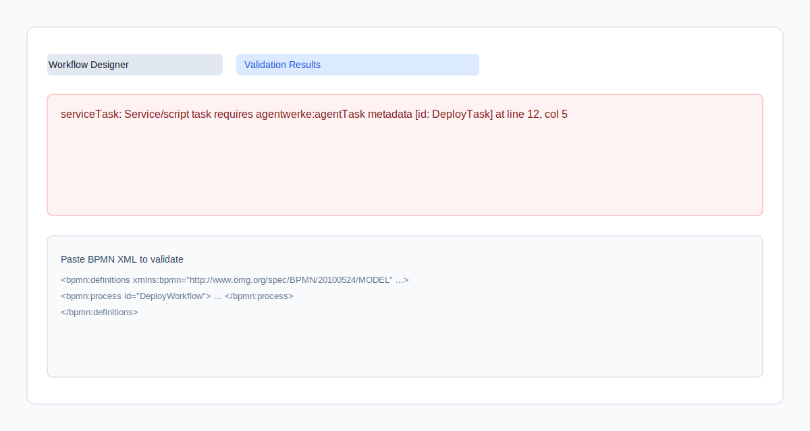
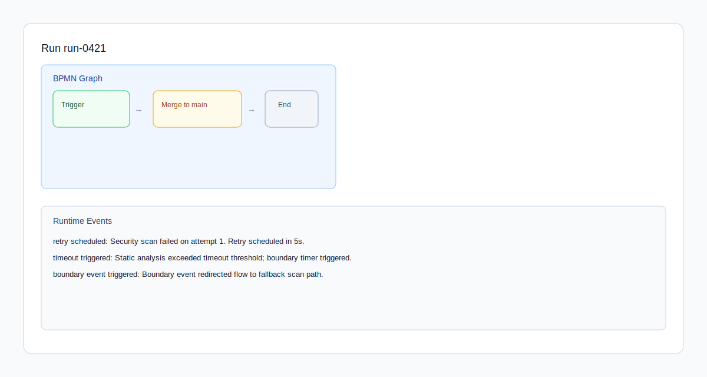

# Autofac Web UI

React + TypeScript frontend for the Autofac operations cockpit.

## Prerequisites

- Node 20+
- npm 10+

## Local Development

1. Install dependencies:

  npm install

2. Start the development server:

  npm run dev

3. Build production assets:

  npm run build

4. Run lint checks:

  npm run lint

5. Run unit and integration tests:

  npm run test

## Environment

- VITE_API_BASE_URL
  - Optional.
  - When omitted, the app uses mock fixtures so it can run offline.
  - When set, the typed API client will call the configured backend.

Example:

VITE_API_BASE_URL=http://localhost:5000

## Implemented Phase-1 Views

- Runs board: /runs
- Run detail: /runs/:runId
- Workflow designer shell: /workflows
- Approvals dashboard: /approvals
- Placeholder sections: /policies, /audit, /integrations, /settings

## BPMN UI MVP (Phase 2.4)

### Implemented flows

- BPMN upload/import in Workflow Designer (`/workflows`)
- Validation results panel with actionable errors (element, message, id, line/column)
- Run graph visualization and runtime event monitor in Run Detail (`/runs/:runId`)
- Retry/timeout/boundary event visibility in runtime events
- HITL approval action flow in Approvals Dashboard (`/approvals`)

### Quick usage flow

1. Open `/workflows`.
2. Click `Import BPMN` and select a `.bpmn` or `.xml` file.
3. Review validation results in the `Validation Results` panel.
4. Open `/runs` and select a run.
5. In run detail, inspect `BPMN Graph` and `Runtime Events` for retry/timeout signals.
6. Open `/approvals` and submit approval/reject/escalate decisions.

### UI snapshots

Workflow Designer validation panel:

Run graph and event monitor:

